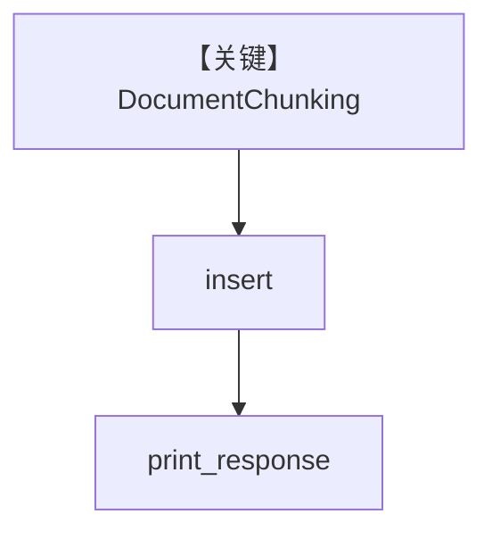

# document_chunking.py — 实现原理分析

> 源文件：`cookbook/07_knowledge/09_archive/chunking/document_chunking.py`

## 概述

本示例展示内置 **`DocumentChunking`** 与 `PDFReader`，`PgVector` 表 `recipes_document_chunking`，Agent 问泰式咖喱做法。

**核心配置一览：**

| 配置项 | 值 | 说明 |
|--------|------|------|
| `DocumentChunking` | 默认策略实例 | 文档级分块 |
| `Knowledge` | `PgVector` | 向量存储 |
| `Agent` | `search_knowledge=True` | 无显式 model |

## 架构分层

```
PDF → DocumentChunking → PgVector → Agent RAG
```

## 核心组件解析

`DocumentChunking` 在语义上偏“按文档结构”切分（实现见 `agno/knowledge/chunking/document`）。

## System Prompt 组装

默认。

## 完整 API 请求

默认 Model。

## Mermaid 流程图



## 关键源码文件索引

| 文件 | 作用 |
|------|------|
| `agno/knowledge/chunking/document.py` | `DocumentChunking` |
