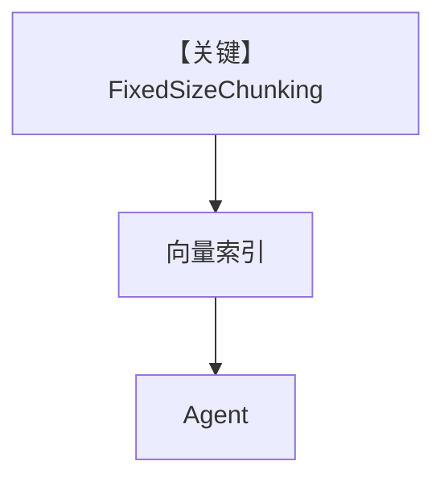

# fixed_size_chunking.py — 实现原理分析

<!-- cookbook-py-source:start -->
## 完整源码

```python
from agno.agent import Agent
from agno.knowledge.chunking.fixed import FixedSizeChunking
from agno.knowledge.knowledge import Knowledge
from agno.knowledge.reader.pdf_reader import PDFReader
from agno.vectordb.pgvector import PgVector

db_url = "postgresql+psycopg://ai:ai@localhost:5532/ai"

knowledge = Knowledge(
    vector_db=PgVector(table_name="recipes_fixed_size_chunking", db_url=db_url),
)

knowledge.insert(
    url="https://agno-public.s3.amazonaws.com/recipes/ThaiRecipes.pdf",
    reader=PDFReader(
        name="Fixed Size Chunking Reader",
        chunking_strategy=FixedSizeChunking(),
    ),
)
agent = Agent(
    knowledge=knowledge,
    search_knowledge=True,
)

agent.print_response("How to make Thai curry?", markdown=True)
```

<!-- cookbook-py-source:end -->

> 源文件：`cookbook/07_knowledge/09_archive/chunking/fixed_size_chunking.py`

## 概述

本示例展示 **`FixedSizeChunking`**：固定窗口切分 PDF，`PgVector` + Agent，问题聚焦泰式咖喱。

**核心配置一览：**

| 配置项 | 值 | 说明 |
|--------|------|------|
| `FixedSizeChunking` | 内置 | 定长 |
| `PDFReader` | 包装 strategy | 摄入 |
| `Agent` | 无显式 model | 默认 |

## 架构分层

```
PDF → FixedSizeChunking → 嵌入 → PgVector → Agent
```

## 核心组件解析

最简单基线：速度与实现复杂度低，可能切断句子。

## System Prompt 组装

默认。

## 完整 API 请求

默认 Model。

## Mermaid 流程图



## 关键源码文件索引

| 文件 | 作用 |
|------|------|
| `agno/knowledge/chunking/fixed.py` | 定长策略 |
