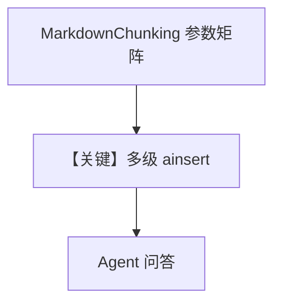

# markdown_chunking.py — 实现原理分析

<!-- cookbook-py-source:start -->
## 完整源码

```python
"""
Markdown Chunking Examples

This cookbook demonstrates different ways to use MarkdownChunking for splitting
markdown documents based on heading structure.
"""

import asyncio

from agno.agent import Agent
from agno.knowledge.chunking.markdown import MarkdownChunking
from agno.knowledge.knowledge import Knowledge
from agno.knowledge.reader.markdown_reader import MarkdownReader
from agno.vectordb.pgvector import PgVector

db_url = "postgresql+psycopg://ai:ai@localhost:5532/ai"

# ==============================================================================
# Example 1: Split on ALL headings (H1-H6)
# ==============================================================================
# This creates the most granular chunks, with each heading becoming a separate chunk.

print("\n" + "=" * 80)
print("Example 1: Split on ALL headings (H1-H6)")
print("=" * 80)

knowledge_all_headings = Knowledge(
    vector_db=PgVector(table_name="recipes_md_all_headings", db_url=db_url),
)

asyncio.run(
    knowledge_all_headings.ainsert(
        path="cookbook/07_knowledge/testing_resources/coffee.md",
        reader=MarkdownReader(
            name="Split All Headings",
            chunking_strategy=MarkdownChunking(split_on_headings=True),
        ),
    )
)

agent = Agent(
    knowledge=knowledge_all_headings,
    search_knowledge=True,
)

agent.print_response("What is a cappuccino?", markdown=True)


# ==============================================================================
# Example 2: Split only on H1 and H2 (keep subsections together)
# ==============================================================================
# This creates medium-sized chunks by splitting on major sections (H1) and
# subsections (H2), while keeping all H3-H6 content together.

print("\n" + "=" * 80)
print("Example 2: Split on H1 and H2 only (keep H3-H6 together)")
print("=" * 80)

knowledge_h1_h2 = Knowledge(
    vector_db=PgVector(table_name="recipes_md_h1_h2", db_url=db_url),
)

asyncio.run(
    knowledge_h1_h2.ainsert(
        path="cookbook/07_knowledge/testing_resources/coffee.md",
        reader=MarkdownReader(
            name="Split H1 and H2",
            chunking_strategy=MarkdownChunking(
                split_on_headings=2
            ),  # Split on level 2 and above
        ),
    )
)

agent = Agent(
    knowledge=knowledge_h1_h2,
    search_knowledge=True,
)

agent.print_response("What are espresso-based drinks?", markdown=True)


# ==============================================================================
# Example 3: Split only on H1 (entire major sections as chunks)
# ==============================================================================
# This creates the largest chunks, keeping entire major sections together.

print("\n" + "=" * 80)
print("Example 3: Split on H1 only (entire major sections)")
print("=" * 80)

knowledge_h1_only = Knowledge(
    vector_db=PgVector(table_name="recipes_md_h1_only", db_url=db_url),
)

asyncio.run(
    knowledge_h1_only.ainsert(
        path="cookbook/07_knowledge/testing_resources/coffee.md",
        reader=MarkdownReader(
            name="Split H1 Only",
            chunking_strategy=MarkdownChunking(split_on_headings=1),  # Split on H1 only
        ),
    )
)

agent = Agent(
    knowledge=knowledge_h1_only,
    search_knowledge=True,
)

agent.print_response("Tell me about types of coffee", markdown=True)


# ==============================================================================
# Example 4: Size-based chunking (traditional approach)
# ==============================================================================
# This uses size-based chunking with the unstructured library, splitting on
# paragraphs when chunks exceed the size limit.

print("\n" + "=" * 80)
print("Example 4: Traditional size-based chunking")
print("=" * 80)

knowledge_size_based = Knowledge(
    vector_db=PgVector(table_name="recipes_md_size_based", db_url=db_url),
)

asyncio.run(
    knowledge_size_based.ainsert(
        path="cookbook/07_knowledge/testing_resources/coffee.md",
        reader=MarkdownReader(
            name="Size Based Chunking",
            chunking_strategy=MarkdownChunking(
                chunk_size=500,  # Maximum chunk size in characters
                overlap=50,  # Character overlap between chunks
                split_on_headings=False,  # Use size-based chunking
            ),
        ),
    )
)

agent = Agent(
    knowledge=knowledge_size_based,
    search_knowledge=True,
)

agent.print_response("How do I make cold brew?", markdown=True)


# ==============================================================================
# Example 5: Split on H1-H3 (balanced approach)
# ==============================================================================
# This creates balanced chunks by splitting on H1, H2, and H3, keeping H4-H6
# content together with their parent H3 sections.

print("\n" + "=" * 80)
print("Example 5: Split on H1, H2, and H3 (balanced)")
print("=" * 80)

knowledge_balanced = Knowledge(
    vector_db=PgVector(table_name="recipes_md_balanced", db_url=db_url),
)

asyncio.run(
    knowledge_balanced.ainsert(
        path="cookbook/07_knowledge/testing_resources/coffee.md",
        reader=MarkdownReader(
            name="Balanced Chunking",
            chunking_strategy=MarkdownChunking(split_on_headings=3),  # Split up to H3
        ),
    )
)

agent = Agent(
    knowledge=knowledge_balanced,
    search_knowledge=True,
)

agent.print_response("What are the different brewing methods?", markdown=True)
```

<!-- cookbook-py-source:end -->

> 源文件：`cookbook/07_knowledge/09_archive/chunking/markdown_chunking.py`

## 概述

本示例用 **`MarkdownChunking`** 多种参数组合（`split_on_headings` True/1/2/3、或 `chunk_size`+`overlap`），对 `coffee.md` 多次 `ainsert` 到不同 `PgVector` 表，每段后 **`Agent` 无显式 model** 提问。

**核心配置一览：**

| 配置项 | 值 | 说明 |
|--------|------|------|
| `MarkdownReader` | 多实例 | MD 摄入 |
| `MarkdownChunking` | 多种构造参数 | 标题级 vs 尺寸级 |
| `asyncio.run(knowledge.ainsert(...))` | 异步插入 | 部分示例 |

## 架构分层

```
coffee.md → MarkdownReader + MarkdownChunking → 不同表 → 多个 Agent 查询
```

## 核心组件解析

对比 **标题语义切块** 与 **传统字符窗口**，便于按文档结构检索（章节对齐）。

### 运行机制与因果链

同一文件写入四张表（示例 1–4/5），演示策略对 chunk 粒度影响。

## System Prompt 组装

`print_response(..., markdown=True)` 控制输出格式；与 chunk 策略独立。

## 完整 API 请求

默认 Model。

## Mermaid 流程图



## 关键源码文件索引

| 文件 | 作用 |
|------|------|
| `agno/knowledge/chunking/markdown.py` | MD 策略 |
| `agno/knowledge/reader/markdown_reader.py` | MD 读取 |
