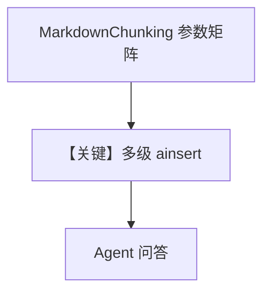

# markdown_chunking.py — 实现原理分析

> 源文件：`cookbook/07_knowledge/09_archive/chunking/markdown_chunking.py`

## 概述

本示例用 **`MarkdownChunking`** 多种参数组合（`split_on_headings` True/1/2/3、或 `chunk_size`+`overlap`），对 `coffee.md` 多次 `ainsert` 到不同 `PgVector` 表，每段后 **`Agent` 无显式 model** 提问。

**核心配置一览：**

| 配置项 | 值 | 说明 |
|--------|------|------|
| `MarkdownReader` | 多实例 | MD 摄入 |
| `MarkdownChunking` | 多种构造参数 | 标题级 vs 尺寸级 |
| `asyncio.run(knowledge.ainsert(...))` | 异步插入 | 部分示例 |

## 架构分层

```
coffee.md → MarkdownReader + MarkdownChunking → 不同表 → 多个 Agent 查询
```

## 核心组件解析

对比 **标题语义切块** 与 **传统字符窗口**，便于按文档结构检索（章节对齐）。

### 运行机制与因果链

同一文件写入四张表（示例 1–4/5），演示策略对 chunk 粒度影响。

## System Prompt 组装

`print_response(..., markdown=True)` 控制输出格式；与 chunk 策略独立。

## 完整 API 请求

默认 Model。

## Mermaid 流程图



## 关键源码文件索引

| 文件 | 作用 |
|------|------|
| `agno/knowledge/chunking/markdown.py` | MD 策略 |
| `agno/knowledge/reader/markdown_reader.py` | MD 读取 |
