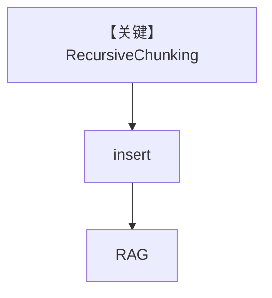

# recursive_chunking.py — 实现原理分析

<!-- cookbook-py-source:start -->
## 完整源码

```python
from agno.agent import Agent
from agno.knowledge.chunking.recursive import RecursiveChunking
from agno.knowledge.knowledge import Knowledge
from agno.knowledge.reader.pdf_reader import PDFReader
from agno.vectordb.pgvector import PgVector

db_url = "postgresql+psycopg://ai:ai@localhost:5532/ai"

knowledge = Knowledge(
    vector_db=PgVector(table_name="recipes_recursive_chunking", db_url=db_url),
)

knowledge.insert(
    url="https://agno-public.s3.amazonaws.com/recipes/ThaiRecipes.pdf",
    reader=PDFReader(
        name="Recursive Chunking Reader",
        chunking_strategy=RecursiveChunking(),
    ),
)

agent = Agent(
    knowledge=knowledge,
    search_knowledge=True,
)

agent.print_response("How to make Thai curry?", markdown=True)
```

<!-- cookbook-py-source:end -->

> 源文件：`cookbook/07_knowledge/09_archive/chunking/recursive_chunking.py`

## 概述

本示例展示 **`RecursiveChunking`**：递归拆分 PDF 文本，`PgVector` 表 `recipes_recursive_chunking`，Agent 查询菜谱。

**核心配置一览：**

| 配置项 | 值 | 说明 |
|--------|------|------|
| `RecursiveChunking` | 默认 | 递归分块 |
| `PDFReader` | 绑定 strategy | 摄入 |

## 架构分层

```
PDF → RecursiveChunking → PgVector → Agent
```

## 核心组件解析

递归策略通常在 oversized chunk 上继续细分，平衡大小与语义（见 `agno/knowledge/chunking/recursive`）。

## System Prompt 组装

默认。

## 完整 API 请求

默认 Model。

## Mermaid 流程图



## 关键源码文件索引

| 文件 | 作用 |
|------|------|
| `agno/knowledge/chunking/recursive.py` | 递归策略 |
