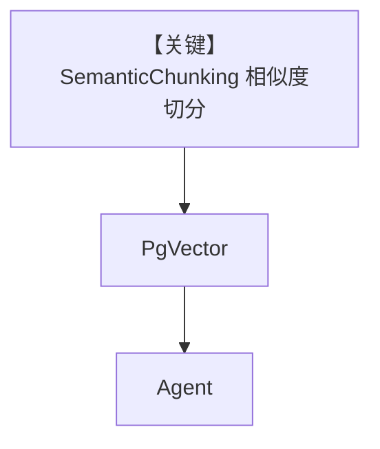

# semantic_chunking.py — 实现原理分析

> 源文件：`cookbook/07_knowledge/09_archive/chunking/semantic_chunking.py`

## 概述

本示例展示 **`SemanticChunking`**：用嵌入相似度与窗口参数在句/段之间找切分点；`embedder` 传入 **字符串模型 id** 时由 chonkie 内建 embedder 解析，`PDFReader` + `PgVector` + Agent。

**核心配置一览：**

| 配置项 | 值 | 说明 |
|--------|------|------|
| `SemanticChunking` | `embedder="text-embedding-3-small"` 等大量参数 | 语义边界 |
| `Knowledge` | `PgVector` 默认 embedder 与 chunk 内 embed 协同 | 需维度一致 |

## 架构分层

```
PDF → SemanticChunking(embedding 相似度) → 向量库 → Agent
```

## 核心组件解析

语义切块减少 **主题混叠**；成本高于固定窗口（多次嵌入计算）。

## System Prompt 组装

默认。

## 完整 API 请求

默认 Model + OpenAI embedding API（chunk 阶段）。

## Mermaid 流程图



## 关键源码文件索引

| 文件 | 作用 |
|------|------|
| `agno/knowledge/chunking/semantic.py` | 语义分块 |
