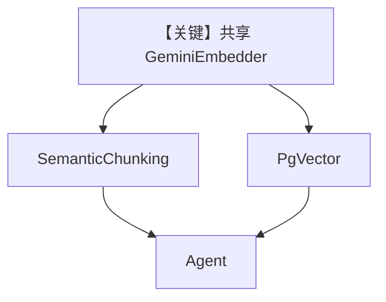

# semantic_chunking_agno_embedder.py — 实现原理分析

<!-- cookbook-py-source:start -->
## 完整源码

```python
from agno.agent import Agent
from agno.knowledge.chunking.semantic import SemanticChunking
from agno.knowledge.embedder.google import GeminiEmbedder
from agno.knowledge.knowledge import Knowledge
from agno.knowledge.reader.pdf_reader import PDFReader
from agno.vectordb.pgvector import PgVector

db_url = "postgresql+psycopg://ai:ai@localhost:5532/ai"

embedder = GeminiEmbedder()

knowledge = Knowledge(
    vector_db=PgVector(
        table_name="recipes_semantic_chunking", db_url=db_url, embedder=embedder
    ),
)
knowledge.insert(
    url="https://agno-public.s3.amazonaws.com/recipes/ThaiRecipes.pdf",
    reader=PDFReader(
        name="Semantic Chunking Reader",
        chunking_strategy=SemanticChunking(
            embedder=embedder,
            chunk_size=500,
            similarity_threshold=0.5,
            similarity_window=3,
            min_sentences_per_chunk=1,
            min_characters_per_sentence=24,
            delimiters=[". ", "! ", "? ", "\n"],
            include_delimiters="prev",
            skip_window=0,
            filter_window=5,
            filter_polyorder=3,
            filter_tolerance=0.2,
        ),
    ),
)

agent = Agent(
    knowledge=knowledge,
    search_knowledge=True,
)

agent.print_response("How to make Thai curry?", markdown=True)
```

<!-- cookbook-py-source:end -->

> 源文件：`cookbook/07_knowledge/09_archive/chunking/semantic_chunking_agno_embedder.py`

## 概述

本示例展示 **同一 `GeminiEmbedder` 实例** 注入 **`PgVector` 与 `SemanticChunking`**，保证 **向量库嵌入与语义切块嵌入一致**，避免维度/空间不一致。

**核心配置一览：**

| 配置项 | 值 | 说明 |
|--------|------|------|
| `embedder` | `GeminiEmbedder()` | 单一实例 |
| `PgVector` | `embedder=embedder` | 入库 |
| `SemanticChunking` | `embedder=embedder` | 切块 |

## 架构分层

```
GeminiEmbedder → 切块嵌入 + 向量存储嵌入 → 同一向量空间
```

## 核心组件解析

若 chunk 与 index 用不同模型，检索质量会下降；本示例强调 **共享 embedder**。

## System Prompt 组装

默认 Agent。

## 完整 API 请求

Gemini Embedding API + 对话模型（默认）。

## Mermaid 流程图



## 关键源码文件索引

| 文件 | 作用 |
|------|------|
| `agno/knowledge/embedder/google.py` | Gemini 嵌入 |
