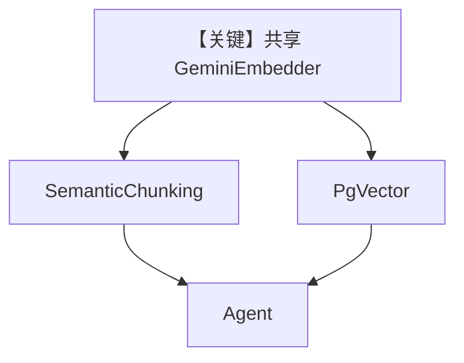

# semantic_chunking_agno_embedder.py — 实现原理分析

> 源文件：`cookbook/07_knowledge/09_archive/chunking/semantic_chunking_agno_embedder.py`

## 概述

本示例展示 **同一 `GeminiEmbedder` 实例** 注入 **`PgVector` 与 `SemanticChunking`**，保证 **向量库嵌入与语义切块嵌入一致**，避免维度/空间不一致。

**核心配置一览：**

| 配置项 | 值 | 说明 |
|--------|------|------|
| `embedder` | `GeminiEmbedder()` | 单一实例 |
| `PgVector` | `embedder=embedder` | 入库 |
| `SemanticChunking` | `embedder=embedder` | 切块 |

## 架构分层

```
GeminiEmbedder → 切块嵌入 + 向量存储嵌入 → 同一向量空间
```

## 核心组件解析

若 chunk 与 index 用不同模型，检索质量会下降；本示例强调 **共享 embedder**。

## System Prompt 组装

默认 Agent。

## 完整 API 请求

Gemini Embedding API + 对话模型（默认）。

## Mermaid 流程图



## 关键源码文件索引

| 文件 | 作用 |
|------|------|
| `agno/knowledge/embedder/google.py` | Gemini 嵌入 |
