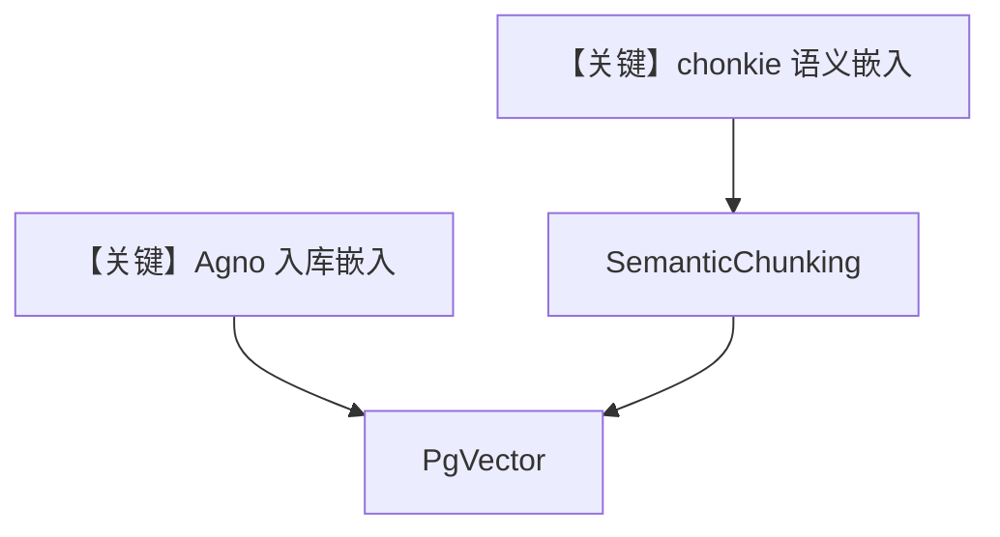

# semantic_chunking_chonkie_embedder.py — 实现原理分析

> 源文件：`cookbook/07_knowledge/09_archive/chunking/semantic_chunking_chonkie_embedder.py`

## 概述

本示例展示 **双嵌入器分工**：`GeminiEmbedder()` 用于 **`PgVector` 入库向量**；`GeminiEmbeddings(model=...)`（chonkie）用于 **`SemanticChunking` 内相似度**；二者语义相近但职责分离，需注意维度/空间一致性风险。

**核心配置一览：**

| 配置项 | 值 | 说明 |
|--------|------|------|
| `agno_embedder` | `GeminiEmbedder()` | 向量库 |
| `chonkie_embedder` | `GeminiEmbeddings(model="gemini-embedding-exp-03-07")` | 切块 |
| `SemanticChunking` | `embedder=chonkie_embedder` | 语义切分 |

## 架构分层

```
PDF → SemanticChunking(chonkie) → 块 → PgVector(agno embedder) → Agent
```

## 核心组件解析

注释已说明：Agno 负责库、chonkie 负责 chunk 内嵌入；生产应评估是否需统一模型。

## System Prompt 组装

默认。

## 完整 API 请求

多次嵌入 API 调用 + 对话模型。

## Mermaid 流程图



## 关键源码文件索引

| 文件 | 作用 |
|------|------|
| `agno/knowledge/chunking/semantic.py` | `SemanticChunking` |
