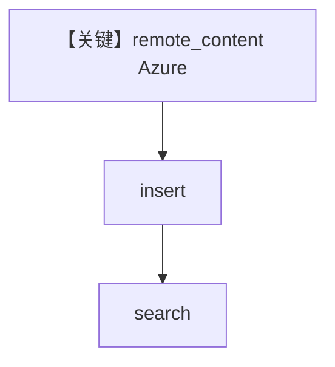

# azure_blob.py — 实现原理分析

> 源文件：`cookbook/07_knowledge/09_archive/cloud/azure_blob.py`

## 概述

归档版 **Azure Blob** 远程摄入：`AzureBlobConfig` + `PgVector` + `content_sources`，`insert` 单文件与前缀目录后 **`knowledge.search`** 打印摘要。**无 Agent**。

**核心配置一览：**

| 配置项 | 值 | 说明 |
|--------|------|------|
| `AzureBlobConfig` | 环境变量驱动 | AD 认证 |
| `Knowledge` | `PgVector`, `content_sources` | 知识库 |
| `Agent` | 无 | 未使用 |

## 架构分层

```
Blob → insert → PgVector → search
```

## 核心组件解析

与 `05_integrations/cloud/02_azure.py`（Qdrant）类似，本文件用 **PgVector** 与更完整文档头。

## System Prompt 组装

无 Agent。

## 完整 API 请求

无 LLM。

## Mermaid 流程图



## 关键源码文件索引

| 文件 | 作用 |
|------|------|
| `agno/knowledge/remote_content` | `AzureBlobConfig` |
