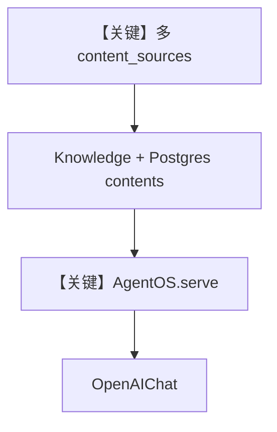

# cloud_agentos.py — 实现原理分析

> 源文件：`cookbook/07_knowledge/09_archive/cloud/cloud_agentos.py`

## 概述

**AgentOS** 聚合多 **`content_sources`**（SharePoint、GitHub、Azure Blob、S3 等，按环境变量条件注册），`PostgresDb` contents + `PgVector`，`Agent(OpenAIChat(gpt-4o-mini))` + `search_knowledge=True`，`serve` 暴露 FastAPI。

**核心配置一览：**

| 配置项 | 值 | 说明 |
|--------|------|------|
| `Knowledge` | `name/description`, `contents_db`, `vector_db`, `content_sources` | 多云 |
| `Agent` | `OpenAIChat(gpt-4o-mini)`, `search_knowledge=True` | Chat 模型 |
| `AgentOS` | `knowledge=[knowledge]`, `agents=[agent]` | OS |
| `serve` | `cloud_agentos:app` | 入口 |

## 架构分层

```
多云配置 → Knowledge → Agent → AgentOS → HTTP
```

## 核心组件解析

`content_sources` 列表动态构建：仅当 env 满足时追加 SharePoint/Azure，避免启动失败。

### 运行机制与因果链

运行后可按文件底部 **curl 示例** 调知识 API 上传远程内容。

## System Prompt 组装

无显式 `instructions`；`markdown` 默认；`description` 在 Knowledge 上用于 OS/元数据。

### 还原说明

Agent 默认 system 含 `OpenAIChat` 的 markdown 附加段；完整文本需运行时打印。

## 完整 API 请求

- **LLM**：`OpenAIChat` → `chat.completions.create`（`agno/models/openai/chat.py`）。
- **HTTP**：AgentOS 路由。

## Mermaid 流程图



## 关键源码文件索引

| 文件 | 作用 |
|------|------|
| `agno/os` | `AgentOS` |
| `agno/models/openai/chat.py` | Chat Completions |
