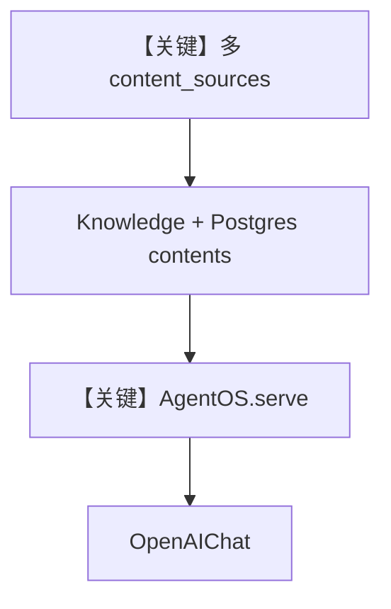

# cloud_agentos.py — 实现原理分析

<!-- cookbook-py-source:start -->
## 完整源码

```python
"""
Cloud Content Sources with AgentOS
============================================================

Sets up an AgentOS app with Knowledge connected to multiple cloud
storage backends (S3, GCS, SharePoint, GitHub, Azure Blob).

Once running, the AgentOS API lets you browse sources, upload
content from any configured source, and search the knowledge base.

Run:
    python cookbook/07_knowledge/cloud/cloud_agentos.py

Key Concepts:
- Each source type has its own config: S3Config, GcsConfig, SharePointConfig, GitHubConfig, AzureBlobConfig
- Configs are registered on Knowledge via `content_sources` parameter
- Configs have factory methods (.file(), .folder()) to create content references
- Content references are passed to knowledge.insert()
"""

from os import getenv

from agno.agent import Agent
from agno.db.postgres import PostgresDb
from agno.knowledge.knowledge import Knowledge
from agno.knowledge.remote_content import (
    AzureBlobConfig,
    GitHubConfig,
    S3Config,
    SharePointConfig,
)
from agno.models.openai import OpenAIChat
from agno.os import AgentOS
from agno.vectordb.pgvector import PgVector

# Database connections
contents_db = PostgresDb(
    db_url="postgresql+psycopg://ai:ai@localhost:5532/ai",
    knowledge_table="knowledge_contents",
)
vector_db = PgVector(
    table_name="knowledge_vectors",
    db_url="postgresql+psycopg://ai:ai@localhost:5532/ai",
)

# Define content source configs (credentials come from env vars).
# Only sources whose required env vars are set will be registered.
content_sources = []

# -- SharePoint (requires SHAREPOINT_TENANT_ID, CLIENT_ID, CLIENT_SECRET, HOSTNAME) --
if getenv("SHAREPOINT_TENANT_ID"):
    content_sources.append(
        SharePointConfig(
            id="sharepoint",
            name="Product Data",
            tenant_id=getenv("SHAREPOINT_TENANT_ID", ""),
            client_id=getenv("SHAREPOINT_CLIENT_ID", ""),
            client_secret=getenv("SHAREPOINT_CLIENT_SECRET", ""),
            hostname=getenv("SHAREPOINT_HOSTNAME", ""),
            site_id=getenv("SHAREPOINT_SITE_ID"),
        )
    )

# -- GitHub (requires GITHUB_TOKEN for private repos) --
content_sources.append(
    GitHubConfig(
        id="my-repo",
        name="My Repository",
        repo=getenv("GITHUB_REPO", "agno-agi/agno"),
        token=getenv("GITHUB_TOKEN"),
        branch="main",
    )
)

# -- Azure Blob (requires AZURE_TENANT_ID, CLIENT_ID, CLIENT_SECRET, STORAGE_ACCOUNT, CONTAINER) --
if getenv("AZURE_TENANT_ID"):
    content_sources.append(
        AzureBlobConfig(
            id="azure-blob",
            name="Azure Blob",
            tenant_id=getenv("AZURE_TENANT_ID", ""),
            client_id=getenv("AZURE_CLIENT_ID", ""),
            client_secret=getenv("AZURE_CLIENT_SECRET", ""),
            storage_account=getenv("AZURE_STORAGE_ACCOUNT_NAME", ""),
            container=getenv("AZURE_CONTAINER_NAME", ""),
        )
    )

# -- S3 (uses default AWS credential chain if env vars are not set) --
content_sources.append(
    S3Config(
        id="s3-docs",
        name="S3 Documents",
        bucket_name=getenv("S3_BUCKET_NAME", "my-docs"),
        region=getenv("AWS_REGION", "us-east-1"),
        aws_access_key_id=getenv("AWS_ACCESS_KEY_ID"),
        aws_secret_access_key=getenv("AWS_SECRET_ACCESS_KEY"),
        prefix="",
    )
)

# Create Knowledge with content sources
knowledge = Knowledge(
    name="Company Knowledge Base",
    description="Unified knowledge from multiple sources",
    contents_db=contents_db,
    vector_db=vector_db,
    content_sources=content_sources,
)

agent = Agent(
    model=OpenAIChat(id="gpt-4o-mini"),
    knowledge=knowledge,
    search_knowledge=True,
)

agent_os = AgentOS(
    knowledge=[knowledge],
    agents=[agent],
)
app = agent_os.get_app()

# ============================================================================
# Run AgentOS
# ============================================================================
if __name__ == "__main__":
    # Serves a FastAPI app exposed by AgentOS. Use reload=True for local dev.
    agent_os.serve(app="cloud_agentos:app", reload=True)


# ============================================================================
# Using the Knowledge API
# ============================================================================
"""
Once AgentOS is running, use the Knowledge API to upload content from remote sources.

## Step 1: Get available content sources

    curl -s http://localhost:7777/v1/knowledge/company-knowledge-base/config | jq

Response:
    {
      "remote_content_sources": [
        {"id": "my-repo", "name": "My Repository", "type": "github"},
        ...
      ]
    }

## Step 2: Upload content

    curl -X POST http://localhost:7777/v1/knowledge/company-knowledge-base/remote-content \\
      -H "Content-Type: application/json" \\
      -d '{
        "name": "Documentation",
        "config_id": "my-repo",
        "path": "docs/README.md"
      }'
"""
```

<!-- cookbook-py-source:end -->

> 源文件：`cookbook/07_knowledge/09_archive/cloud/cloud_agentos.py`

## 概述

**AgentOS** 聚合多 **`content_sources`**（SharePoint、GitHub、Azure Blob、S3 等，按环境变量条件注册），`PostgresDb` contents + `PgVector`，`Agent(OpenAIChat(gpt-4o-mini))` + `search_knowledge=True`，`serve` 暴露 FastAPI。

**核心配置一览：**

| 配置项 | 值 | 说明 |
|--------|------|------|
| `Knowledge` | `name/description`, `contents_db`, `vector_db`, `content_sources` | 多云 |
| `Agent` | `OpenAIChat(gpt-4o-mini)`, `search_knowledge=True` | Chat 模型 |
| `AgentOS` | `knowledge=[knowledge]`, `agents=[agent]` | OS |
| `serve` | `cloud_agentos:app` | 入口 |

## 架构分层

```
多云配置 → Knowledge → Agent → AgentOS → HTTP
```

## 核心组件解析

`content_sources` 列表动态构建：仅当 env 满足时追加 SharePoint/Azure，避免启动失败。

### 运行机制与因果链

运行后可按文件底部 **curl 示例** 调知识 API 上传远程内容。

## System Prompt 组装

无显式 `instructions`；`markdown` 默认；`description` 在 Knowledge 上用于 OS/元数据。

### 还原说明

Agent 默认 system 含 `OpenAIChat` 的 markdown 附加段；完整文本需运行时打印。

## 完整 API 请求

- **LLM**：`OpenAIChat` → `chat.completions.create`（`agno/models/openai/chat.py`）。
- **HTTP**：AgentOS 路由。

## Mermaid 流程图



## 关键源码文件索引

| 文件 | 作用 |
|------|------|
| `agno/os` | `AgentOS` |
| `agno/models/openai/chat.py` | Chat Completions |
