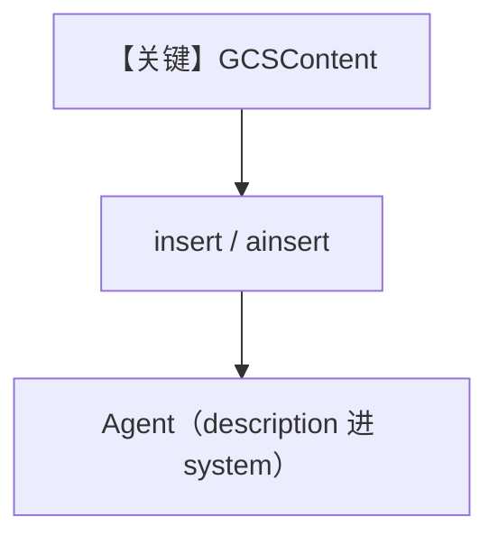

# from_gcs.py — 实现原理分析

<!-- cookbook-py-source:start -->
## 完整源码

```python
"""
From GCS
========

Demonstrates loading knowledge from GCS remote content using sync and async inserts.
"""

import asyncio

from agno.agent import Agent
from agno.db.postgres.postgres import PostgresDb
from agno.knowledge.knowledge import Knowledge
from agno.knowledge.remote_content.remote_content import GCSContent
from agno.vectordb.pgvector import PgVector

# ---------------------------------------------------------------------------
# Setup
# ---------------------------------------------------------------------------
contents_db = PostgresDb(db_url="postgresql+psycopg://ai:ai@localhost:5532/ai")
vector_db = PgVector(
    table_name="vectors", db_url="postgresql+psycopg://ai:ai@localhost:5532/ai"
)


# ---------------------------------------------------------------------------
# Create Knowledge Base
# ---------------------------------------------------------------------------
def create_knowledge() -> Knowledge:
    return Knowledge(
        name="Basic SDK Knowledge Base",
        description="Agno 2.0 Knowledge Implementation",
        contents_db=contents_db,
        vector_db=vector_db,
    )


# ---------------------------------------------------------------------------
# Create Agent
# ---------------------------------------------------------------------------
def create_agent(knowledge: Knowledge) -> Agent:
    return Agent(
        name="My Agent",
        description="Agno 2.0 Agent Implementation",
        knowledge=knowledge,
        search_knowledge=True,
        debug_mode=True,
    )


# ---------------------------------------------------------------------------
# Run Agent
# ---------------------------------------------------------------------------
def run_sync() -> None:
    knowledge = create_knowledge()
    knowledge.insert(
        name="GCS PDF",
        remote_content=GCSContent(
            bucket_name="thai-recepies", blob_name="ThaiRecipes.pdf"
        ),
        metadata={"remote_content": "GCS"},
    )

    agent = create_agent(knowledge)
    agent.print_response(
        "What is the best way to make a Thai curry?",
        markdown=True,
    )


async def run_async() -> None:
    knowledge = create_knowledge()
    await knowledge.ainsert(
        name="GCS PDF",
        remote_content=GCSContent(
            bucket_name="thai-recepies", blob_name="ThaiRecipes.pdf"
        ),
        metadata={"remote_content": "GCS"},
    )

    agent = create_agent(knowledge)
    agent.print_response(
        "What is the best way to make a Thai curry?",
        markdown=True,
    )


if __name__ == "__main__":
    run_sync()
    asyncio.run(run_async())
```

<!-- cookbook-py-source:end -->

> 源文件：`cookbook/07_knowledge/09_archive/cloud/from_gcs.py`

## 概述

演示 **`GCSContent`** 远程对象：`insert`/`ainsert` 指向 bucket/blob，`PostgresDb` contents + `PgVector`；`create_agent` 带 **name、description、debug_mode=True**，同步与异步各跑一遍。

**核心配置一览：**

| 配置项 | 值 | 说明 |
|--------|------|------|
| `Knowledge` | `name`, `description`, `contents_db`, `vector_db` | 知识库 |
| `Agent` | `name="My Agent"`, `description="Agno 2.0 Agent Implementation"`, `search_knowledge=True`, `debug_mode=True` | **无显式 model** |

## 架构分层

```
GCSContent → insert/ainsert → Agent.print_response
```

## 核心组件解析

`metadata` 标记 `remote_content: GCS` 便于 contents 追踪。

### 运行机制与因果链

`run_sync` 与 `run_async` 并行演示两种 API；需有效 GCP 凭据与 bucket。

## System Prompt 组装

显式 **`description`** 进入 `get_system_message` 的 `# 3.3.1`（`agno/agent/_messages.py`）。

### 还原后的完整 System 文本（可静态部分）

```text
Agno 2.0 Agent Implementation

<additional_information>
- Use markdown to format your answers.
</additional_information>
```

（`instructions` 未设置；若 `add_search_knowledge_instructions` 默认 True，另有知识库工具说明。）

## 完整 API 请求

取决于默认 `Model`；`debug_mode=True` 时日志更详细。

## Mermaid 流程图



## 关键源码文件索引

| 文件 | 作用 |
|------|------|
| `agno/knowledge/remote_content/remote_content.py` | `GCSContent` |
| `agno/agent/_messages.py` | `description` 段 L235-236 |
