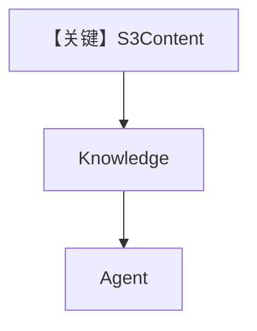

# from_s3.py — 实现原理分析

<!-- cookbook-py-source:start -->
## 完整源码

```python
"""
From S3
=======

Demonstrates loading knowledge from S3 remote content using sync and async inserts.
"""

import asyncio

from agno.agent import Agent
from agno.db.postgres.postgres import PostgresDb
from agno.knowledge.knowledge import Knowledge
from agno.knowledge.remote_content.remote_content import S3Content
from agno.vectordb.pgvector import PgVector

# ---------------------------------------------------------------------------
# Setup
# ---------------------------------------------------------------------------
contents_db = PostgresDb(db_url="postgresql+psycopg://ai:ai@localhost:5532/ai")
vector_db = PgVector(
    table_name="vectors", db_url="postgresql+psycopg://ai:ai@localhost:5532/ai"
)


# ---------------------------------------------------------------------------
# Create Knowledge Base
# ---------------------------------------------------------------------------
def create_knowledge() -> Knowledge:
    return Knowledge(
        name="Basic SDK Knowledge Base",
        description="Agno 2.0 Knowledge Implementation",
        contents_db=contents_db,
        vector_db=vector_db,
    )


# ---------------------------------------------------------------------------
# Create Agent
# ---------------------------------------------------------------------------
def create_agent(knowledge: Knowledge) -> Agent:
    return Agent(
        name="My Agent",
        description="Agno 2.0 Agent Implementation",
        knowledge=knowledge,
        search_knowledge=True,
        debug_mode=True,
    )


# ---------------------------------------------------------------------------
# Run Agent
# ---------------------------------------------------------------------------
def run_sync() -> None:
    knowledge = create_knowledge()
    knowledge.insert(
        name="S3 PDF",
        remote_content=S3Content(
            bucket_name="agno-public", key="recipes/ThaiRecipes.pdf"
        ),
        metadata={"remote_content": "S3"},
    )

    agent = create_agent(knowledge)
    agent.print_response(
        "What is the best way to make a Thai curry?",
        markdown=True,
    )


async def run_async() -> None:
    knowledge = create_knowledge()
    await knowledge.ainsert(
        name="S3 PDF",
        remote_content=S3Content(
            bucket_name="agno-public", key="recipes/ThaiRecipes.pdf"
        ),
        metadata={"remote_content": "S3"},
    )

    agent = create_agent(knowledge)
    agent.print_response(
        "What is the best way to make a Thai curry?",
        markdown=True,
    )


if __name__ == "__main__":
    run_sync()
    asyncio.run(run_async())
```

<!-- cookbook-py-source:end -->

> 源文件：`cookbook/07_knowledge/09_archive/cloud/from_s3.py`

## 概述

与 `from_gcs.py` 对称，使用 **`S3Content`**（bucket `agno-public`, key 菜谱 PDF），`PostgresDb` + `PgVector`，同步/异步 `insert`/`ainsert`，`Agent` 同结构 **name/description/debug_mode**，**无显式 model**。

**核心配置一览：**

| 配置项 | 值 | 说明 |
|--------|------|------|
| `S3Content` | bucket + key | S3 对象 |
| `Agent.description` | `"Agno 2.0 Agent Implementation"` | system 描述段 |

## 架构分层

```
S3 → Knowledge → Agent.print_response
```

## 核心组件解析

公开 bucket 可直接演示；私有桶需 IAM/密钥。

## System Prompt 组装

`description` 原样进入 system 前部（见 `_messages.py` #3.3.1）。

### 还原后的完整 System 文本（可静态部分）

```text
Agno 2.0 Agent Implementation

<additional_information>
- Use markdown to format your answers.
</additional_information>
```

## 完整 API 请求

默认 Model。

## Mermaid 流程图



## 关键源码文件索引

| 文件 | 作用 |
|------|------|
| `agno/knowledge/remote_content/remote_content.py` | `S3Content` |
