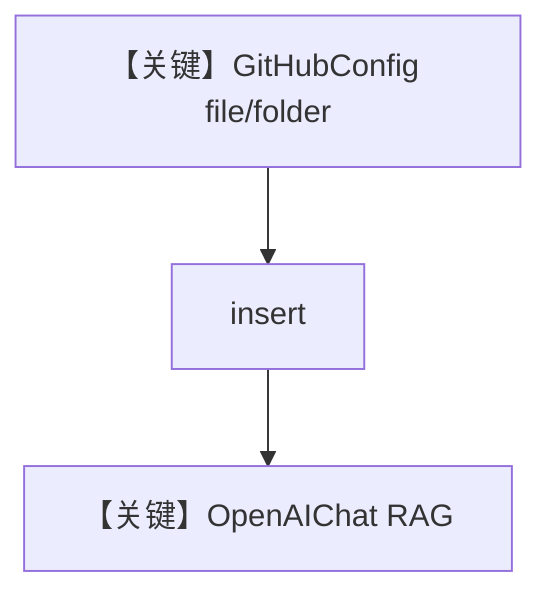

# github.py — 实现原理分析

<!-- cookbook-py-source:start -->
## 完整源码

```python
"""
GitHub Content Source for Knowledge
====================================

Load files and folders from GitHub repositories into your Knowledge base,
then query them with an Agent.

Authentication methods:
- Personal Access Token (PAT): simple, set ``token``
- GitHub App: enterprise-grade, set ``app_id``, ``installation_id``, ``private_key``

Requirements:
- PostgreSQL with pgvector: ``./cookbook/scripts/run_pgvector.sh``
- For private repos with PAT: GitHub fine-grained PAT with "Contents: read" permission
- For GitHub App auth: ``pip install PyJWT cryptography``

Run this cookbook:
    python cookbook/07_knowledge/cloud/github.py
"""

from os import getenv

from agno.agent import Agent
from agno.knowledge.knowledge import Knowledge
from agno.knowledge.remote_content import GitHubConfig
from agno.models.openai import OpenAIChat
from agno.vectordb.pgvector import PgVector

# ---------------------------------------------------------------------------
# Option 1: Personal Access Token authentication
# ---------------------------------------------------------------------------
# For private repos, set GITHUB_TOKEN env var to a fine-grained PAT with "Contents: read"
github_config = GitHubConfig(
    id="my-repo",
    name="My Repository",
    repo="owner/repo",  # Format: owner/repo
    token=getenv("GITHUB_TOKEN"),  # Optional for public repos
    branch="main",
)

# ---------------------------------------------------------------------------
# Option 2: GitHub App authentication
# ---------------------------------------------------------------------------
# For organizations using GitHub Apps instead of personal tokens.
# Requires: pip install PyJWT cryptography
#
# github_config = GitHubConfig(
#     id="org-repo",
#     name="Org Repository",
#     repo="owner/repo",
#     app_id=getenv("GITHUB_APP_ID"),
#     installation_id=getenv("GITHUB_INSTALLATION_ID"),
#     private_key=getenv("GITHUB_APP_PRIVATE_KEY"),
#     branch="main",
# )

# ---------------------------------------------------------------------------
# Knowledge Base
# ---------------------------------------------------------------------------
knowledge = Knowledge(
    name="GitHub Knowledge",
    vector_db=PgVector(
        table_name="github_knowledge",
        db_url="postgresql+psycopg://ai:ai@localhost:5532/ai",
    ),
    content_sources=[github_config],
)

# ---------------------------------------------------------------------------
# Agent
# ---------------------------------------------------------------------------
agent = Agent(
    model=OpenAIChat(id="gpt-5.1"),
    name="GitHub Agent",
    knowledge=knowledge,
    search_knowledge=True,
)

# ---------------------------------------------------------------------------
# Run
# ---------------------------------------------------------------------------
if __name__ == "__main__":
    # Insert a single file
    print("Inserting README from GitHub...")
    knowledge.insert(
        name="README",
        remote_content=github_config.file("README.md"),
    )

    # Insert an entire folder (recursive)
    print("Inserting folder from GitHub...")
    knowledge.insert(
        name="Docs",
        remote_content=github_config.folder("docs"),
    )

    # Query the knowledge base through the agent
    agent.print_response(
        "Summarize what this repository is about based on the README",
        markdown=True,
    )
```

<!-- cookbook-py-source:end -->

> 源文件：`cookbook/07_knowledge/09_archive/cloud/github.py`

## 概述

**GitHubConfig** 从仓库拉取文件/目录，`PgVector` + `content_sources`；`Agent(OpenAIChat(id="gpt-5.1"), name="GitHub Agent", search_knowledge=True)`，`insert` README 与 `docs` 后 **`print_response`**。

**核心配置一览：**

| 配置项 | 值 | 说明 |
|--------|------|------|
| `GitHubConfig` | `repo`, `token`, `branch` | 源 |
| `Agent.model` | `OpenAIChat(gpt-5.1)` | Chat Completions |
| `Agent.name` | `"GitHub Agent"` | 仅当 `add_name_to_context` 时进 system，本文件未设 |

## 架构分层

```
GitHub API → insert → PgVector → Agent → OpenAIChat
```

## 核心组件解析

支持 PAT 与 GitHub App 注释块；公开库可无 token。

## System Prompt 组装

无 `instructions`；`markdown` 来自 `print_response(markdown=True)`。

### 还原后的完整 System 文本

基线为 markdown 附加段；完整含工具/知识说明时请运行时验证。

## 完整 API 请求

```python
client.chat.completions.create(
    model="gpt-5.1",
    messages=[...],
    stream=False,
)
```

## Mermaid 流程图



## 关键源码文件索引

| 文件 | 作用 |
|------|------|
| `agno/knowledge/remote_content` | `GitHubConfig` |
| `agno/models/openai/chat.py` | Chat API |
