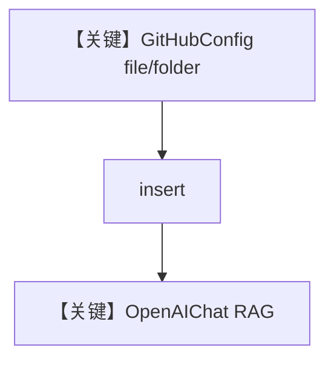

# github.py — 实现原理分析

> 源文件：`cookbook/07_knowledge/09_archive/cloud/github.py`

## 概述

**GitHubConfig** 从仓库拉取文件/目录，`PgVector` + `content_sources`；`Agent(OpenAIChat(id="gpt-5.1"), name="GitHub Agent", search_knowledge=True)`，`insert` README 与 `docs` 后 **`print_response`**。

**核心配置一览：**

| 配置项 | 值 | 说明 |
|--------|------|------|
| `GitHubConfig` | `repo`, `token`, `branch` | 源 |
| `Agent.model` | `OpenAIChat(gpt-5.1)` | Chat Completions |
| `Agent.name` | `"GitHub Agent"` | 仅当 `add_name_to_context` 时进 system，本文件未设 |

## 架构分层

```
GitHub API → insert → PgVector → Agent → OpenAIChat
```

## 核心组件解析

支持 PAT 与 GitHub App 注释块；公开库可无 token。

## System Prompt 组装

无 `instructions`；`markdown` 来自 `print_response(markdown=True)`。

### 还原后的完整 System 文本

基线为 markdown 附加段；完整含工具/知识说明时请运行时验证。

## 完整 API 请求

```python
client.chat.completions.create(
    model="gpt-5.1",
    messages=[...],
    stream=False,
)
```

## Mermaid 流程图



## 关键源码文件索引

| 文件 | 作用 |
|------|------|
| `agno/knowledge/remote_content` | `GitHubConfig` |
| `agno/models/openai/chat.py` | Chat API |
