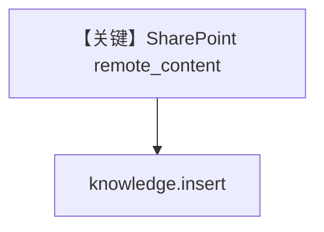

# sharepoint.py — 实现原理分析

> 源文件：`cookbook/07_knowledge/09_archive/cloud/sharepoint.py`

## 概述

**SharePointConfig** + `PgVector` + `content_sources`，`insert` 单文件与文件夹；文件在 **`if __name__` 内仅执行摄入**，未展示 `Agent` 或 `search`（与部分集成示例不同）。

**核心配置一览：**

| 配置项 | 值 | 说明 |
|--------|------|------|
| `SharePointConfig` | tenant/client/hostname/site_id | Graph |
| `Knowledge` | `content_sources` | 知识库 |
| `Agent` | 无 | 本脚本未使用 |

## 架构分层

```
SharePoint → insert → PgVector（查询需另写或 AgentOS）
```

## 核心组件解析

权限需 `Sites.Read.All`；`site_id` 与 `site_path` 二选一注释说明。

## System Prompt 组装

无 Agent。

## 完整 API 请求

无 LLM。

## Mermaid 流程图



## 关键源码文件索引

| 文件 | 作用 |
|------|------|
| `agno/knowledge/remote_content` | `SharePointConfig` |
