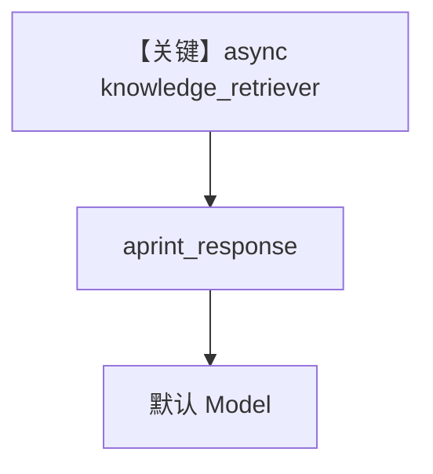

# async_retriever.py — 实现原理分析

> 源文件：`cookbook/07_knowledge/09_archive/custom_retriever/async_retriever.py`

## 概述

**异步自定义 `knowledge_retriever`**：`AsyncQdrantClient.query_points` + `OpenAIEmbedder.get_embedding`，与 `Knowledge(Qdrant)` 共用 collection；`Agent` 配置 `knowledge_retriever=knowledge_retriever`、`instructions="Search the knowledge base for information"`，**无显式 model**；`aprint_response` 演示异步路径。

**核心配置一览：**

| 配置项 | 值 | 说明 |
|--------|------|------|
| `knowledge_retriever` | `async def knowledge_retriever(query, agent, ...)` | 异步检索 |
| `instructions` | 固定英文句 | system 指令 |
| `search_knowledge` | 默认 True | 工具链 |

## 架构分层

```
query → embed → AsyncQdrant query_points → 列表 dict → Agent 消息
```

## 核心组件解析

签名使用 `query` 为第一参数（与部分示例 `agent` 在前不同），框架通过 `inspect.signature` 传参（见 `_messages.py` L1792+）。

### 运行机制与因果链

必须先 `knowledge.insert` 填充 collection，否则检索为空。

## System Prompt 组装

`instructions` 进入 `# 3.3.3` 列表。

### 还原后的完整 System 文本（指令字面量）

```text
Search the knowledge base for information
```

另含 markdown 附加段等默认拼装。

## 完整 API 请求

默认 Model 的异步 `ainvoke`/`responses` 路径。

## Mermaid 流程图



## 关键源码文件索引

| 文件 | 作用 |
|------|------|
| `agno/agent/_messages.py` | retriever 调用 L1792+ |
