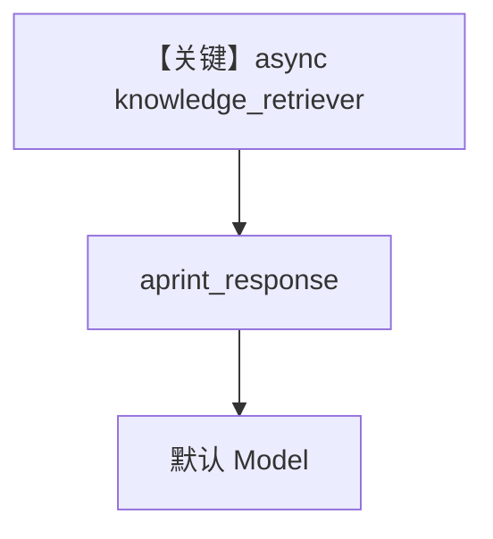

# async_retriever.py — 实现原理分析

<!-- cookbook-py-source:start -->
## 完整源码

```python
import asyncio
from typing import Optional

from agno.agent import Agent
from agno.knowledge.embedder.openai import OpenAIEmbedder
from agno.knowledge.knowledge import Knowledge
from agno.vectordb.qdrant import Qdrant
from qdrant_client import AsyncQdrantClient

# ---------------------------------------------------------
# This section loads the knowledge base. Skip if your knowledge base was populated elsewhere.
# Define the embedder
embedder = OpenAIEmbedder(id="text-embedding-3-small")
# Initialize vector database connection
vector_db = Qdrant(
    collection="thai-recipes", url="http://localhost:6333", embedder=embedder
)
# Load the knowledge base
knowledge = Knowledge(
    vector_db=vector_db,
)

knowledge.insert(
    url="https://agno-public.s3.amazonaws.com/recipes/ThaiRecipes.pdf",
)


# ---------------------------------------------------------
# Define the custom async knowledge retriever
# This is the function that the agent will use to retrieve documents
async def knowledge_retriever(
    query: str, agent: Optional[Agent] = None, num_documents: int = 5, **kwargs
) -> Optional[list[dict]]:
    """
    Custom async knowledge retriever function to search the vector database for relevant documents.

    Args:
        query (str): The search query string
        agent (Agent): The agent instance making the query
        num_documents (int): Number of documents to retrieve (default: 5)
        **kwargs: Additional keyword arguments

    Returns:
        Optional[list[dict]]: List of retrieved documents or None if search fails
    """
    try:
        qdrant_client = AsyncQdrantClient(url="http://localhost:6333")
        query_embedding = embedder.get_embedding(query)
        results = await qdrant_client.query_points(
            collection_name="thai-recipes",
            query=query_embedding,
            limit=num_documents,
        )
        results_dict = results.model_dump()
        if "points" in results_dict:
            return results_dict["points"]
        else:
            return None
    except Exception as e:
        print(f"Error during vector database search: {str(e)}")
        return None


async def amain():
    """Async main function to demonstrate agent usage."""
    # Initialize agent with custom knowledge retriever
    # The knowledge object is required to register the search_knowledge_base tool
    # The knowledge_retriever overrides the default retrieval logic
    agent = Agent(
        knowledge=knowledge,
        knowledge_retriever=knowledge_retriever,
        search_knowledge=True,
        instructions="Search the knowledge base for information",
    )

    # Example query
    query = "List down the ingredients to make Massaman Gai"
    await agent.aprint_response(query, markdown=True)


def main():
    """Synchronous wrapper for main function"""
    asyncio.run(amain())


if __name__ == "__main__":
    main()
```

<!-- cookbook-py-source:end -->

> 源文件：`cookbook/07_knowledge/09_archive/custom_retriever/async_retriever.py`

## 概述

**异步自定义 `knowledge_retriever`**：`AsyncQdrantClient.query_points` + `OpenAIEmbedder.get_embedding`，与 `Knowledge(Qdrant)` 共用 collection；`Agent` 配置 `knowledge_retriever=knowledge_retriever`、`instructions="Search the knowledge base for information"`，**无显式 model**；`aprint_response` 演示异步路径。

**核心配置一览：**

| 配置项 | 值 | 说明 |
|--------|------|------|
| `knowledge_retriever` | `async def knowledge_retriever(query, agent, ...)` | 异步检索 |
| `instructions` | 固定英文句 | system 指令 |
| `search_knowledge` | 默认 True | 工具链 |

## 架构分层

```
query → embed → AsyncQdrant query_points → 列表 dict → Agent 消息
```

## 核心组件解析

签名使用 `query` 为第一参数（与部分示例 `agent` 在前不同），框架通过 `inspect.signature` 传参（见 `_messages.py` L1792+）。

### 运行机制与因果链

必须先 `knowledge.insert` 填充 collection，否则检索为空。

## System Prompt 组装

`instructions` 进入 `# 3.3.3` 列表。

### 还原后的完整 System 文本（指令字面量）

```text
Search the knowledge base for information
```

另含 markdown 附加段等默认拼装。

## 完整 API 请求

默认 Model 的异步 `ainvoke`/`responses` 路径。

## Mermaid 流程图



## 关键源码文件索引

| 文件 | 作用 |
|------|------|
| `agno/agent/_messages.py` | retriever 调用 L1792+ |
