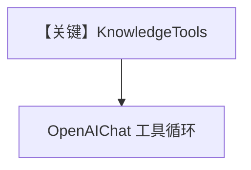

# knowledge_tools.py — 实现原理分析

<!-- cookbook-py-source:start -->
## 完整源码

```python
"""
Here is a tool with reasoning capabilities to allow agents to search and analyze information from a knowledge base.

1. Run: `uv pip install openai agno lancedb tantivy sqlalchemy` to install the dependencies
2. Export your OPENAI_API_KEY
3. Run: `python cookbook/07_knowledge/knowledge_tools.py` to run the agent
"""

from agno.agent import Agent
from agno.knowledge.embedder.openai import OpenAIEmbedder
from agno.knowledge.knowledge import Knowledge
from agno.models.openai import OpenAIChat
from agno.tools.knowledge import KnowledgeTools
from agno.vectordb.lancedb import LanceDb, SearchType

# Create a knowledge containing information from a URL
agno_docs = Knowledge(
    # Use LanceDB as the vector database and store embeddings in the `agno_docs` table
    vector_db=LanceDb(
        uri="tmp/lancedb",
        table_name="agno_docs",
        search_type=SearchType.hybrid,
        embedder=OpenAIEmbedder(id="text-embedding-3-small"),
    ),
)
# Add content to the knowledge
agno_docs.insert(url="https://docs.agno.com/llms-full.txt")

knowledge_tools = KnowledgeTools(
    knowledge=agno_docs,
    enable_think=True,
    enable_search=True,
    enable_analyze=True,
    add_few_shot=True,
)

agent = Agent(
    model=OpenAIChat(id="gpt-4o"),
    tools=[knowledge_tools],
    markdown=True,
)

if __name__ == "__main__":
    agent.print_response(
        "How do I build a team of agents in agno?",
        markdown=True,
        stream=True,
    )
```

<!-- cookbook-py-source:end -->

> 源文件：`cookbook/07_knowledge/09_archive/custom_retriever/knowledge_tools.py`

## 概述

归档版 **`KnowledgeTools` + LanceDB**：`agno_docs` 表 hybrid，`insert` 文档后 `Agent(OpenAIChat(gpt-4o), tools=[knowledge_tools], markdown=True)`，流式 `print_response`。

**核心配置一览：**

| 配置项 | 值 | 说明 |
|--------|------|------|
| `LanceDb` | `tmp/lancedb`, `SearchType.hybrid` | 本地向量 |
| `KnowledgeTools` | think/search/analyze + few_shot | 工具集 |
| `Agent.model` | `OpenAIChat(gpt-4o)` | Chat Completions |

## 架构分层

```
Knowledge → KnowledgeTools → Agent → chat.completions + tools
```

## 核心组件解析

与 `04_advanced/04_knowledge_tools.py` 同模式，向量后端换为 **LanceDB**。

## System Prompt 组装

工具与 few-shot 由框架注入；无自定义 `instructions` 字符串。

## 完整 API 请求

`chat.completions.create` + `tools`。

## Mermaid 流程图



## 关键源码文件索引

| 文件 | 作用 |
|------|------|
| `agno/tools/knowledge.py` | KnowledgeTools |
