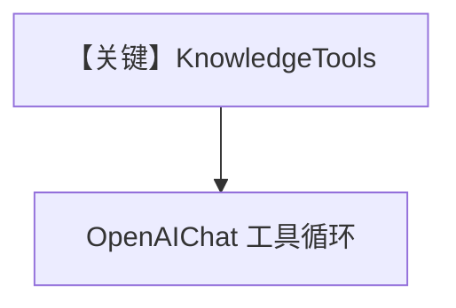

# knowledge_tools.py — 实现原理分析

> 源文件：`cookbook/07_knowledge/09_archive/custom_retriever/knowledge_tools.py`

## 概述

归档版 **`KnowledgeTools` + LanceDB**：`agno_docs` 表 hybrid，`insert` 文档后 `Agent(OpenAIChat(gpt-4o), tools=[knowledge_tools], markdown=True)`，流式 `print_response`。

**核心配置一览：**

| 配置项 | 值 | 说明 |
|--------|------|------|
| `LanceDb` | `tmp/lancedb`, `SearchType.hybrid` | 本地向量 |
| `KnowledgeTools` | think/search/analyze + few_shot | 工具集 |
| `Agent.model` | `OpenAIChat(gpt-4o)` | Chat Completions |

## 架构分层

```
Knowledge → KnowledgeTools → Agent → chat.completions + tools
```

## 核心组件解析

与 `04_advanced/04_knowledge_tools.py` 同模式，向量后端换为 **LanceDB**。

## System Prompt 组装

工具与 few-shot 由框架注入；无自定义 `instructions` 字符串。

## 完整 API 请求

`chat.completions.create` + `tools`。

## Mermaid 流程图



## 关键源码文件索引

| 文件 | 作用 |
|------|------|
| `agno/tools/knowledge.py` | KnowledgeTools |
