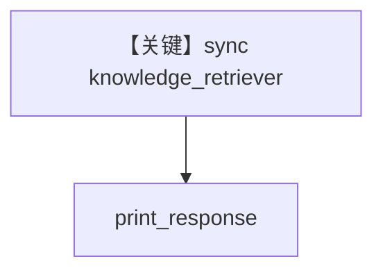

# retriever.py — 实现原理分析

> 源文件：`cookbook/07_knowledge/09_archive/custom_retriever/retriever.py`

## 概述

**同步** `knowledge_retriever`：`QdrantClient.query_points` + `OpenAIEmbedder`，`instructions="Search the knowledge base for information"`，**无显式 model**；`print_response` 查询 Massaman Gai 配料。

**核心配置一览：**

| 配置项 | 值 | 说明 |
|--------|------|------|
| `knowledge_retriever` | 同步函数 | 阻塞 Qdrant |
| `knowledge` | `Qdrant` + 先 `insert` PDF | 数据准备 |

## 架构分层

```
sync retriever → Qdrant → Agent
```

## 核心组件解析

与 `async_retriever.py` 对照：同步客户端与 `print_response` 主流程。

## System Prompt 组装

```text
Search the knowledge base for information
```
（嵌入默认 system 拼装，见 `01_custom_retriever` 同系列。）

## 完整 API 请求

默认 Model。

## Mermaid 流程图



## 关键源码文件索引

| 文件 | 作用 |
|------|------|
| `agno/agent/_messages.py` | retriever 注入 |
