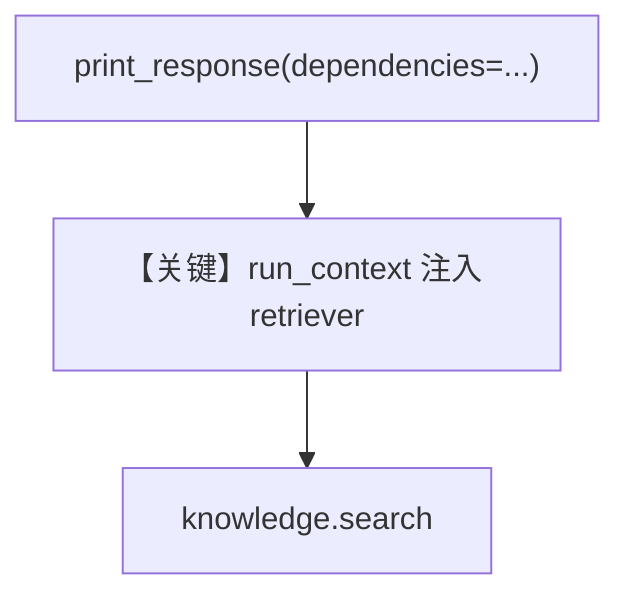

# retriever_with_dependencies.py — 实现原理分析

> 源文件：`cookbook/07_knowledge/09_archive/custom_retriever/retriever_with_dependencies.py`

## 概述

**带 `run_context` 的 `knowledge_retriever`**：从 `run_context.dependencies` 读取角色/偏好（示例打印），实际检索仍用 `knowledge.search`；`Agent(OpenAIChat(gpt-4o), instructions=...)`，两次 `print_response` 第二次传入 `dependencies={...}`。

**核心配置一览：**

| 配置项 | 值 | 说明 |
|--------|------|------|
| `knowledge_retriever` | 含 `run_context: Optional[RunContext]` | 运行时依赖 |
| `Agent.model` | `OpenAIChat(gpt-4o)` | Chat |
| `instructions` | 英文长句 | 引导用工具 |

## 架构分层

```
print_response(..., dependencies=...) → RunContext → retriever 内读取 → knowledge.search
```

## 核心组件解析

展示 **检索逻辑如何随用户上下文分支**（本例仅打印，可扩展为过滤）。

### 运行机制与因果链

`dependencies` 不参与嵌入，仅 Python 侧可用；过滤应在 retriever 或 `knowledge_filters` 层实现。

## System Prompt 组装

`instructions` 字面量进入 system。

### 还原后的完整 System 文本（指令）

```text
Search the knowledge base for information. Use the search_knowledge_base tool when needed.
```

## 完整 API 请求

`OpenAIChat` → `chat.completions.create`。

## Mermaid 流程图



## 关键源码文件索引

| 文件 | 作用 |
|------|------|
| `agno/run` | `RunContext` |
| `agno/agent/_messages.py` | retriever kwargs 含 `run_context` |
