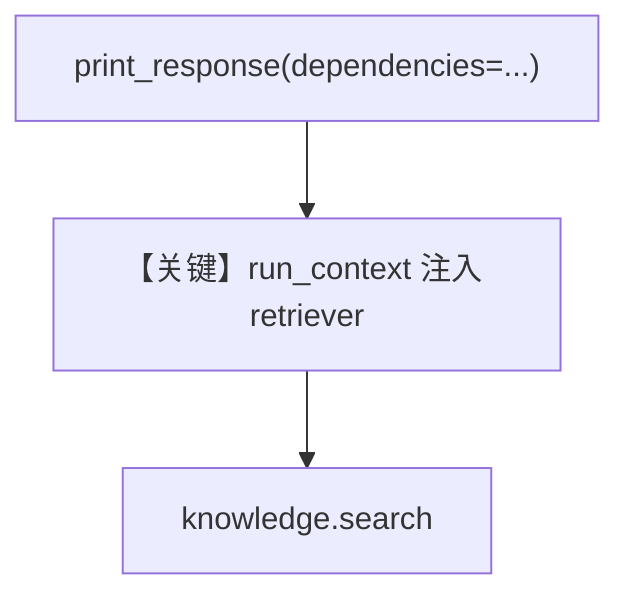

# retriever_with_dependencies.py — 实现原理分析

<!-- cookbook-py-source:start -->
## 完整源码

```python
"""
Example demonstrating custom knowledge retriever with runtime dependencies.

This cookbook shows how to access dependencies passed at runtime (e.g., via agent.run(dependencies={...}))
in a custom knowledge retriever function.

Key points:
1. Add 'run_context' parameter to your retriever function signature
2. Dependencies are automatically passed from run_context when available
3. Use dependencies to customize retrieval behavior based on user context
"""

import asyncio
from typing import Optional

from agno.agent import Agent
from agno.knowledge.embedder.openai import OpenAIEmbedder
from agno.knowledge.knowledge import Knowledge
from agno.models.openai import OpenAIChat
from agno.run import RunContext
from agno.vectordb.pgvector import PgVector

db_url = "postgresql+psycopg://ai:ai@localhost:5532/ai"
# Initialize knowledge base
knowledge = Knowledge(
    vector_db=PgVector(
        table_name="dependencies_knowledge",
        db_url=db_url,
        embedder=OpenAIEmbedder(id="text-embedding-3-small"),
    ),
)

# Add some sample content
asyncio.run(
    knowledge.ainsert(
        url="https://docs.agno.com/llms-full.txt",
    )
)


def knowledge_retriever(
    query: str,
    agent: Optional[Agent] = None,
    num_documents: int = 5,
    run_context: Optional[RunContext] = None,
    **kwargs,
) -> Optional[list[dict]]:
    """
    Custom knowledge retriever that uses runtime dependencies.

    Args:
        query: The search query string
        agent: The agent instance making the query
        num_documents: Number of documents to retrieve (default: 5)
        run_context: Runtime context containing dependencies and other context
        **kwargs: Additional keyword arguments

    Returns:
        List of retrieved documents or None if search fails
    """
    # Extract dependencies from run_context
    dependencies = run_context.dependencies if run_context else None

    print("\n=== Knowledge Retriever Called ===")
    print(f"Query: {query}")
    print(f"Dependencies available: {dependencies is not None}")

    if dependencies:
        print(f"Dependencies keys: {list(dependencies.keys())}")

        # Example: Use user role from dependencies to filter results
        user_role = dependencies.get("role", "user")
        print(f"User role: {user_role}")

        # Example: Use user preferences to customize search
        if "preferences" in dependencies:
            print(f"User preferences: {dependencies['preferences']}")

    # Perform the actual search
    try:
        docs = knowledge.search(
            query=query,
            max_results=num_documents,
        )
        print(f"Found {len(docs)} documents")
        return [doc.to_dict() for doc in docs]
    except Exception as e:
        print(f"Error during knowledge retrieval: {e}")
        return []


agent = Agent(
    name="KnowledgeAgent",
    model=OpenAIChat(id="gpt-4o"),
    knowledge=knowledge,
    knowledge_retriever=knowledge_retriever,
    search_knowledge=True,
    instructions="Search the knowledge base for information. Use the search_knowledge_base tool when needed.",
)

print("=== Example 1: Without Dependencies ===\n")
agent.print_response(
    "What are AI agents?",
    markdown=True,
)

print("\n\n=== Example 2: With Runtime Dependencies ===\n")
agent.print_response(
    "What are AI agents?",
    markdown=True,
    dependencies={
        "role": "admin",
        "preferences": ["AI", "Machine Learning"],
    },
)
```

<!-- cookbook-py-source:end -->

> 源文件：`cookbook/07_knowledge/09_archive/custom_retriever/retriever_with_dependencies.py`

## 概述

**带 `run_context` 的 `knowledge_retriever`**：从 `run_context.dependencies` 读取角色/偏好（示例打印），实际检索仍用 `knowledge.search`；`Agent(OpenAIChat(gpt-4o), instructions=...)`，两次 `print_response` 第二次传入 `dependencies={...}`。

**核心配置一览：**

| 配置项 | 值 | 说明 |
|--------|------|------|
| `knowledge_retriever` | 含 `run_context: Optional[RunContext]` | 运行时依赖 |
| `Agent.model` | `OpenAIChat(gpt-4o)` | Chat |
| `instructions` | 英文长句 | 引导用工具 |

## 架构分层

```
print_response(..., dependencies=...) → RunContext → retriever 内读取 → knowledge.search
```

## 核心组件解析

展示 **检索逻辑如何随用户上下文分支**（本例仅打印，可扩展为过滤）。

### 运行机制与因果链

`dependencies` 不参与嵌入，仅 Python 侧可用；过滤应在 retriever 或 `knowledge_filters` 层实现。

## System Prompt 组装

`instructions` 字面量进入 system。

### 还原后的完整 System 文本（指令）

```text
Search the knowledge base for information. Use the search_knowledge_base tool when needed.
```

## 完整 API 请求

`OpenAIChat` → `chat.completions.create`。

## Mermaid 流程图



## 关键源码文件索引

| 文件 | 作用 |
|------|------|
| `agno/run` | `RunContext` |
| `agno/agent/_messages.py` | retriever kwargs 含 `run_context` |
