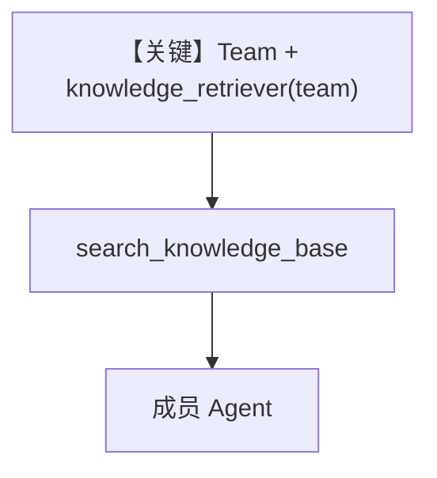

# team_retriever.py — 实现原理分析

<!-- cookbook-py-source:start -->
## 完整源码

```python
from typing import Optional

from agno.agent import Agent
from agno.knowledge.embedder.openai import OpenAIEmbedder
from agno.knowledge.knowledge import Knowledge
from agno.team.team import Team
from agno.vectordb.qdrant import Qdrant
from qdrant_client import QdrantClient

# ---------------------------------------------------------
# This section loads the knowledge base. Skip if your knowledge base was populated elsewhere.
# Define the embedder
embedder = OpenAIEmbedder(id="text-embedding-3-small")
# Initialize vector database connection
vector_db = Qdrant(
    collection="thai-recipes", url="http://localhost:6333", embedder=embedder
)
# Load the knowledge base
knowledge = Knowledge(
    vector_db=vector_db,
)

knowledge.insert(
    url="https://agno-public.s3.amazonaws.com/recipes/ThaiRecipes.pdf",
)

# ---------------------------------------------------------


# Define the custom knowledge retriever
def knowledge_retriever(
    query: str, team: Optional[Team] = None, num_documents: int = 5, **kwargs
) -> Optional[list[dict]]:
    """
    Custom knowledge retriever function for a Team.

    Args:
        query (str): The search query string
        team (Team): The team instance making the query
        num_documents (int): Number of documents to retrieve (default: 5)
        **kwargs: Additional keyword arguments

    Returns:
        Optional[list[dict]]: List of retrieved documents or None if search fails
    """
    try:
        qdrant_client = QdrantClient(url="http://localhost:6333")
        query_embedding = embedder.get_embedding(query)
        results = qdrant_client.query_points(
            collection_name="thai-recipes",
            query=query_embedding,
            limit=num_documents,
        )
        results_dict = results.model_dump()
        if "points" in results_dict:
            return results_dict["points"]
        else:
            return None
    except Exception as e:
        print(f"Error during vector database search: {str(e)}")
        return None


def main():
    """Main function to demonstrate team usage with a custom knowledge retriever."""
    # Create a member agent that summarizes recipes
    summary_agent = Agent(
        name="Summary Agent",
        role="Summarize and format recipe information into clear, readable responses",
    )

    # Initialize team with custom knowledge retriever
    # The team searches the knowledge base directly using the custom retriever,
    # then delegates formatting tasks to the summary agent.
    team = Team(
        name="Recipe Team",
        members=[summary_agent],
        knowledge=knowledge,
        knowledge_retriever=knowledge_retriever,
        search_knowledge=True,
        instructions=[
            "Always use the search_knowledge_base tool to find recipe information before delegating to members.",
            "Delegate to the Summary Agent only for formatting the results.",
        ],
    )

    # Example query
    query = "List down the ingredients to make Massaman Gai"
    team.print_response(query, markdown=True)


if __name__ == "__main__":
    main()
```

<!-- cookbook-py-source:end -->

> 源文件：`cookbook/07_knowledge/09_archive/custom_retriever/team_retriever.py`

## 概述

**Team 级 `knowledge_retriever`**：签名含 `team: Optional[Team]`，用 `QdrantClient` 查 `thai-recipes`；`Team(members=[summary_agent], knowledge=..., knowledge_retriever=..., search_knowledge=True, instructions=[...])`，**无 Team 显式 model**（依框架默认）。

**核心配置一览：**

| 配置项 | 值 | 说明 |
|--------|------|------|
| `knowledge_retriever` | `team` 参数 | Team 调用 |
| `Team.instructions` | 两条英文 | 协调策略 |
| `summary_agent` | 仅 `name`+`role` | 成员 |

## 架构分层

```
Team.run → knowledge_retriever(team, ...) → Qdrant → 委派 Agent
```

## 核心组件解析

与 `Agent` 版 retriever 差异：首参可为 `team` 而非 `agent`（见 `_messages` 对 signature 的分派）。

## System Prompt 组装

Team 级 instructions 进入 Team 的 system 拼装路径（非本文件内 Agent 单独构造）。

### 还原后的完整 Team 指令（列表拼接）

```text
Always use the search_knowledge_base tool to find recipe information before delegating to members.
Delegate to the Summary Agent only for formatting the results.
```

## 完整 API 请求

Team 默认 model 的 chat/completions 或等价路径。

## Mermaid 流程图



## 关键源码文件索引

| 文件 | 作用 |
|------|------|
| `agno/team/team.py` | `Team` |
| `agno/agent/_messages.py` | retriever 参数解析 |
