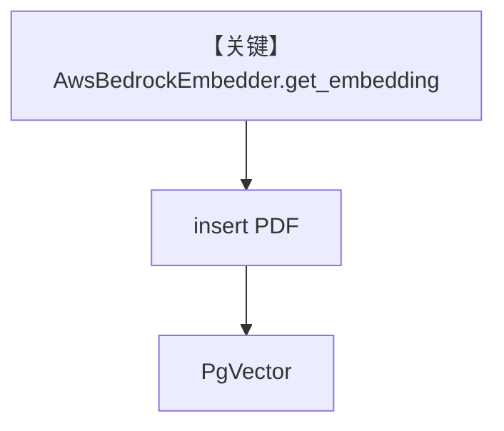

# aws_bedrock_embedder.py — 实现原理分析

> 源文件：`cookbook/07_knowledge/09_archive/embedders/aws_bedrock_embedder.py`

## 概述

演示 **`AwsBedrockEmbedder`**（Cohere v3 经 Bedrock）+ **`FixedSizeChunking`** 与 `PDFReader` 摄入；`PgVector` 表 `recipes`。**无 Agent**，`main()` 打印向量维度并 `insert` PDF。

**核心配置一览：**

| 配置项 | 值 | 说明 |
|--------|------|------|
| `AwsBedrockEmbedder` | 默认 + `input_type` 区分 document/query | Bedrock |
| `Knowledge` | `PgVector(embedder=AwsBedrockEmbedder(input_type=search_document))` | 入库 |
| `Agent` | 无 | 未使用 |

## 架构分层

```
Bedrock embed → PgVector；可选 PDFReader+FixedSizeChunking 在 insert 路径
```

## System Prompt 组装

无 Agent。

## 完整 API 请求

AWS Bedrock `InvokeModel`（由 `AwsBedrockEmbedder` 封装）；无 OpenAI。

## Mermaid 流程图



## 关键源码文件索引

| 文件 | 作用 |
|------|------|
| `agno/knowledge/embedder/aws_bedrock.py` | Bedrock 嵌入 |
