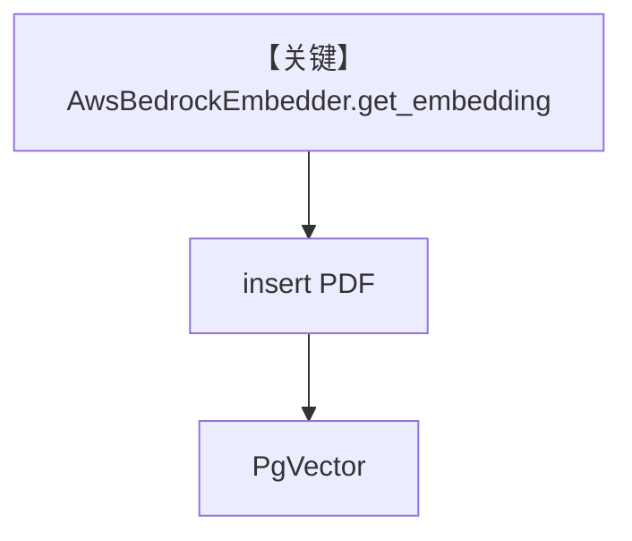

# aws_bedrock_embedder.py — 实现原理分析

<!-- cookbook-py-source:start -->
## 完整源码

```python
"""
AWS Bedrock Embedder
====================

Demonstrates Cohere v3 embeddings through AWS Bedrock and knowledge insertion.

Requirements:
- AWS credentials (AWS_ACCESS_KEY_ID, AWS_SECRET_ACCESS_KEY)
- AWS region configured (AWS_REGION)
- boto3 installed: pip install boto3
"""

from agno.knowledge.chunking.fixed import FixedSizeChunking
from agno.knowledge.embedder.aws_bedrock import AwsBedrockEmbedder
from agno.knowledge.knowledge import Knowledge
from agno.knowledge.reader.pdf_reader import PDFReader
from agno.vectordb.pgvector import PgVector

# ---------------------------------------------------------------------------
# Setup
# ---------------------------------------------------------------------------
embedder = AwsBedrockEmbedder()

# ---------------------------------------------------------------------------
# Create Knowledge Base
# ---------------------------------------------------------------------------
knowledge = Knowledge(
    vector_db=PgVector(
        table_name="recipes",
        db_url="postgresql+psycopg://ai:ai@localhost:5532/ai",
        embedder=AwsBedrockEmbedder(input_type="search_document"),
    ),
)


# ---------------------------------------------------------------------------
# Run Agent
# ---------------------------------------------------------------------------
def main() -> None:
    embeddings = embedder.get_embedding("The quick brown fox jumps over the lazy dog.")
    print(f"Embeddings (first 5): {embeddings[:5]}")
    print(f"Dimensions: {len(embeddings)}")

    knowledge.insert(
        url="https://agno-public.s3.amazonaws.com/recipes/ThaiRecipes.pdf",
        reader=PDFReader(chunking_strategy=FixedSizeChunking(chunk_size=1500)),
    )


if __name__ == "__main__":
    main()
```

<!-- cookbook-py-source:end -->

> 源文件：`cookbook/07_knowledge/09_archive/embedders/aws_bedrock_embedder.py`

## 概述

演示 **`AwsBedrockEmbedder`**（Cohere v3 经 Bedrock）+ **`FixedSizeChunking`** 与 `PDFReader` 摄入；`PgVector` 表 `recipes`。**无 Agent**，`main()` 打印向量维度并 `insert` PDF。

**核心配置一览：**

| 配置项 | 值 | 说明 |
|--------|------|------|
| `AwsBedrockEmbedder` | 默认 + `input_type` 区分 document/query | Bedrock |
| `Knowledge` | `PgVector(embedder=AwsBedrockEmbedder(input_type=search_document))` | 入库 |
| `Agent` | 无 | 未使用 |

## 架构分层

```
Bedrock embed → PgVector；可选 PDFReader+FixedSizeChunking 在 insert 路径
```

## System Prompt 组装

无 Agent。

## 完整 API 请求

AWS Bedrock `InvokeModel`（由 `AwsBedrockEmbedder` 封装）；无 OpenAI。

## Mermaid 流程图



## 关键源码文件索引

| 文件 | 作用 |
|------|------|
| `agno/knowledge/embedder/aws_bedrock.py` | Bedrock 嵌入 |
