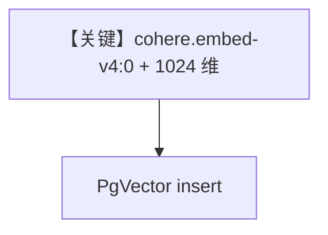

# aws_bedrock_embedder_v4.py — 实现原理分析

<!-- cookbook-py-source:start -->
## 完整源码

```python
"""
AWS Bedrock Embedder v4
=======================

Demonstrates Cohere v4 embeddings on AWS Bedrock with configurable dimensions.

Requirements:
- AWS credentials (AWS_ACCESS_KEY_ID, AWS_SECRET_ACCESS_KEY)
- AWS region configured (AWS_REGION)
- boto3 installed: pip install boto3
"""

from agno.knowledge.embedder.aws_bedrock import AwsBedrockEmbedder
from agno.knowledge.knowledge import Knowledge
from agno.vectordb.pgvector import PgVector

# ---------------------------------------------------------------------------
# Setup
# ---------------------------------------------------------------------------
embedder_v4 = AwsBedrockEmbedder(
    id="cohere.embed-v4:0",
    output_dimension=1024,
    input_type="search_query",
)

# ---------------------------------------------------------------------------
# Create Knowledge Base
# ---------------------------------------------------------------------------
knowledge = Knowledge(
    vector_db=PgVector(
        table_name="ml_knowledge",
        db_url="postgresql+psycopg://ai:ai@localhost:5532/ai",
        embedder=AwsBedrockEmbedder(
            id="cohere.embed-v4:0",
            output_dimension=1024,
            input_type="search_document",
        ),
    ),
)


# ---------------------------------------------------------------------------
# Run Agent
# ---------------------------------------------------------------------------
def main() -> None:
    text = "What is machine learning?"
    embeddings = embedder_v4.get_embedding(text)
    print(f"Model: {embedder_v4.id}")
    print(f"Embeddings (first 5): {embeddings[:5]}")
    print(f"Dimensions: {len(embeddings)}")

    print("\n--- Testing different dimensions ---")
    for dim in [256, 512, 1024, 1536]:
        emb = AwsBedrockEmbedder(id="cohere.embed-v4:0", output_dimension=dim)
        result = emb.get_embedding("Test text")
        print(f"Dimension {dim}: Got {len(result)} dimensional vector")

    _ = knowledge


if __name__ == "__main__":
    main()
```

<!-- cookbook-py-source:end -->

> 源文件：`cookbook/07_knowledge/09_archive/embedders/aws_bedrock_embedder_v4.py`

## 概述

演示 **Cohere embed v4 在 Bedrock 上**：`AwsBedrockEmbedder(id="cohere.embed-v4:0", output_dimension=1024, input_type=...)`；查询与文档嵌入分别配置 `search_query` / `search_document`；`PgVector` 表 `ml_knowledge`。**无 Agent**。

**核心配置一览：**

| 配置项 | 值 | 说明 |
|--------|------|------|
| `embedder_v4` | v4 id + 1024 维 | 显式维度 |
| `Knowledge` | 双处 `AwsBedrockEmbedder` 配置一致 | 入库 |

## System Prompt 组装

无 Agent。

## 完整 API 请求

Bedrock Invoke；无 OpenAI Chat。

## Mermaid 流程图



## 关键源码文件索引

| 文件 | 作用 |
|------|------|
| `agno/knowledge/embedder/aws_bedrock.py` | v4 参数 |
