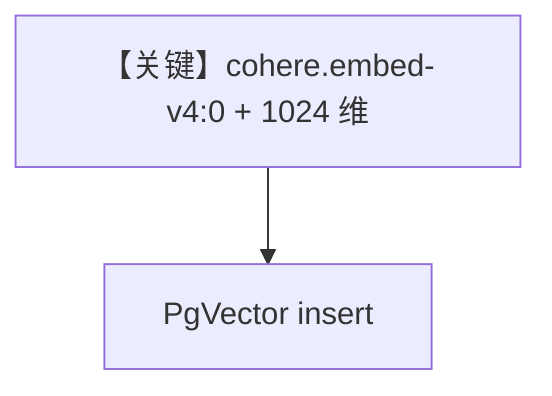

# aws_bedrock_embedder_v4.py — 实现原理分析

> 源文件：`cookbook/07_knowledge/09_archive/embedders/aws_bedrock_embedder_v4.py`

## 概述

演示 **Cohere embed v4 在 Bedrock 上**：`AwsBedrockEmbedder(id="cohere.embed-v4:0", output_dimension=1024, input_type=...)`；查询与文档嵌入分别配置 `search_query` / `search_document`；`PgVector` 表 `ml_knowledge`。**无 Agent**。

**核心配置一览：**

| 配置项 | 值 | 说明 |
|--------|------|------|
| `embedder_v4` | v4 id + 1024 维 | 显式维度 |
| `Knowledge` | 双处 `AwsBedrockEmbedder` 配置一致 | 入库 |

## System Prompt 组装

无 Agent。

## 完整 API 请求

Bedrock Invoke；无 OpenAI Chat。

## Mermaid 流程图

## 关键源码文件索引

| 文件 | 作用 |
|------|------|
| `agno/knowledge/embedder/aws_bedrock.py` | v4 参数 |
