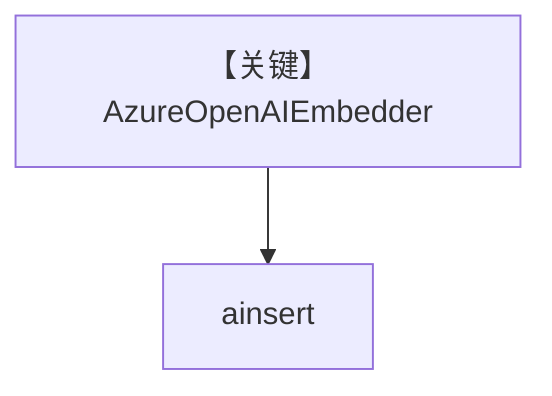

# azure_embedder.py — 实现原理分析

> 源文件：`cookbook/07_knowledge/09_archive/embedders/azure_embedder.py`

## 概述

**`AzureOpenAIEmbedder`** + `PgVector`，`create_knowledge()` 可选 batch 模式；`main` 中 `get_embedding` 演示后 `ainsert` PDF。**无 Agent**。

**核心配置一览：**

| 配置项 | 值 | 说明 |
|--------|------|------|
| `AzureOpenAIEmbedder` | 标准 / `enable_batch` 注释 | Azure OpenAI 嵌入 |
| `Knowledge.max_results` | `2` | 检索上限 |

## System Prompt 组装

无 Agent。

## 完整 API 请求

Azure OpenAI Embeddings API。

## Mermaid 流程图

## 关键源码文件索引

| 文件 | 作用 |
|------|------|
| `agno/knowledge/embedder/azure_openai.py` | Azure 嵌入 |
