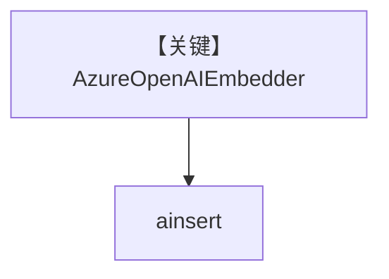

# azure_embedder.py — 实现原理分析

<!-- cookbook-py-source:start -->
## 完整源码

```python
"""
Azure OpenAI Embedder
=====================

Demonstrates Azure OpenAI embeddings and knowledge insertion, including a batching variant.
"""

import asyncio

from agno.knowledge.embedder.azure_openai import AzureOpenAIEmbedder
from agno.knowledge.knowledge import Knowledge
from agno.vectordb.pgvector import PgVector


# ---------------------------------------------------------------------------
# Create Knowledge Base
# ---------------------------------------------------------------------------
def create_knowledge() -> Knowledge:
    # Standard mode
    embedder = AzureOpenAIEmbedder()

    # Batching mode (uncomment to use)
    # embedder = AzureOpenAIEmbedder(enable_batch=True)

    return Knowledge(
        vector_db=PgVector(
            db_url="postgresql+psycopg://ai:ai@localhost:5532/ai",
            table_name="azure_openai_embeddings",
            embedder=embedder,
        ),
        max_results=2,
    )


# ---------------------------------------------------------------------------
# Run Agent
# ---------------------------------------------------------------------------
async def main() -> None:
    embeddings = AzureOpenAIEmbedder(id="text-embedding-3-small").get_embedding(
        "The quick brown fox jumps over the lazy dog."
    )
    print(f"Embeddings: {embeddings[:5]}")
    print(f"Dimensions: {len(embeddings)}")

    knowledge = create_knowledge()
    await knowledge.ainsert(path="cookbook/07_knowledge/testing_resources/cv_1.pdf")


if __name__ == "__main__":
    asyncio.run(main())
```

<!-- cookbook-py-source:end -->

> 源文件：`cookbook/07_knowledge/09_archive/embedders/azure_embedder.py`

## 概述

**`AzureOpenAIEmbedder`** + `PgVector`，`create_knowledge()` 可选 batch 模式；`main` 中 `get_embedding` 演示后 `ainsert` PDF。**无 Agent**。

**核心配置一览：**

| 配置项 | 值 | 说明 |
|--------|------|------|
| `AzureOpenAIEmbedder` | 标准 / `enable_batch` 注释 | Azure OpenAI 嵌入 |
| `Knowledge.max_results` | `2` | 检索上限 |

## System Prompt 组装

无 Agent。

## 完整 API 请求

Azure OpenAI Embeddings API。

## Mermaid 流程图



## 关键源码文件索引

| 文件 | 作用 |
|------|------|
| `agno/knowledge/embedder/azure_openai.py` | Azure 嵌入 |
