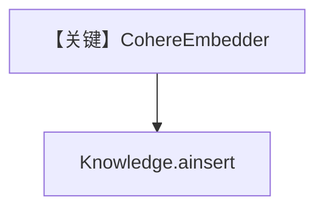

# cohere_embedder.py — 实现原理分析

> 源文件：`cookbook/07_knowledge/09_archive/embedders/cohere_embedder.py`

## 概述

**`CohereEmbedder(dimensions=1024)`** + `PgVector`，可选 batch/backoff 注释；`ainsert` 测试 PDF。**无 Agent**。

**核心配置一览：**

| 配置项 | 值 | 说明 |
|--------|------|------|
| `CohereEmbedder` | `dimensions=1024` | Cohere 向量维 |

## System Prompt 组装

无 Agent。

## 完整 API 请求

Cohere Embed API。

## Mermaid 流程图

## 关键源码文件索引

| 文件 | 作用 |
|------|------|
| `agno/knowledge/embedder/cohere.py` | Cohere |
