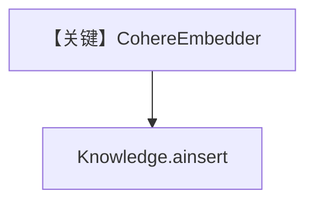

# cohere_embedder.py — 实现原理分析

<!-- cookbook-py-source:start -->
## 完整源码

```python
"""
Cohere Embedder
===============

Demonstrates Cohere embeddings and knowledge insertion, including a batching variant.
"""

import asyncio

from agno.knowledge.embedder.cohere import CohereEmbedder
from agno.knowledge.knowledge import Knowledge
from agno.vectordb.pgvector import PgVector


# ---------------------------------------------------------------------------
# Create Knowledge Base
# ---------------------------------------------------------------------------
def create_knowledge() -> Knowledge:
    # Standard mode
    embedder = CohereEmbedder(dimensions=1024)

    # Batching mode (uncomment to use)
    # embedder = CohereEmbedder(
    #     dimensions=1024,
    #     enable_batch=True,
    #     batch_size=100,
    #     exponential_backoff=True,
    # )

    return Knowledge(
        vector_db=PgVector(
            db_url="postgresql+psycopg://ai:ai@localhost:5532/ai",
            table_name="cohere_embeddings",
            embedder=embedder,
        ),
        max_results=2,
    )


# ---------------------------------------------------------------------------
# Run Agent
# ---------------------------------------------------------------------------
async def main() -> None:
    embeddings = CohereEmbedder().get_embedding(
        "The quick brown fox jumps over the lazy dog."
    )
    print(f"Embeddings: {embeddings[:5]}")
    print(f"Dimensions: {len(embeddings)}")

    knowledge = create_knowledge()
    await knowledge.ainsert(path="cookbook/07_knowledge/testing_resources/cv_1.pdf")


if __name__ == "__main__":
    asyncio.run(main())
```

<!-- cookbook-py-source:end -->

> 源文件：`cookbook/07_knowledge/09_archive/embedders/cohere_embedder.py`

## 概述

**`CohereEmbedder(dimensions=1024)`** + `PgVector`，可选 batch/backoff 注释；`ainsert` 测试 PDF。**无 Agent**。

**核心配置一览：**

| 配置项 | 值 | 说明 |
|--------|------|------|
| `CohereEmbedder` | `dimensions=1024` | Cohere 向量维 |

## System Prompt 组装

无 Agent。

## 完整 API 请求

Cohere Embed API。

## Mermaid 流程图



## 关键源码文件索引

| 文件 | 作用 |
|------|------|
| `agno/knowledge/embedder/cohere.py` | Cohere |
