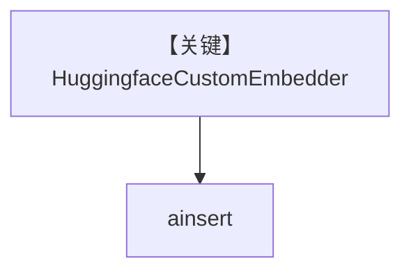

# huggingface_embedder.py — 实现原理分析

> 源文件：`cookbook/07_knowledge/09_archive/embedders/huggingface_embedder.py`

## 概述

**`HuggingfaceCustomEmbedder(dimensions=1024)`** + `PgVector`，`ainsert` CV PDF。**无 Agent**。

## System Prompt 组装

无 Agent。

## 完整 API 请求

本地/ HF 推理端嵌入（依 embedder 实现）。

## Mermaid 流程图

## 关键源码文件索引

| 文件 | 作用 |
|------|------|
| `agno/knowledge/embedder/huggingface.py` | HF |
