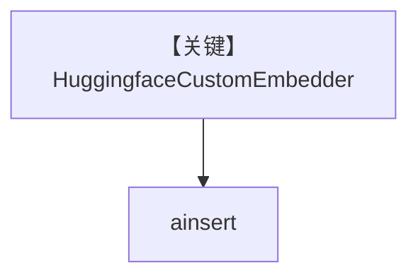

# huggingface_embedder.py — 实现原理分析

<!-- cookbook-py-source:start -->
## 完整源码

```python
"""
Hugging Face Embedder
=====================

Demonstrates Hugging Face custom embeddings and knowledge insertion.
"""

import asyncio

from agno.knowledge.embedder.huggingface import HuggingfaceCustomEmbedder
from agno.knowledge.knowledge import Knowledge
from agno.vectordb.pgvector import PgVector

# ---------------------------------------------------------------------------
# Create Knowledge Base
# ---------------------------------------------------------------------------
knowledge = Knowledge(
    vector_db=PgVector(
        db_url="postgresql+psycopg://ai:ai@localhost:5532/ai",
        table_name="huggingface_embeddings",
        embedder=HuggingfaceCustomEmbedder(dimensions=1024),
    ),
    max_results=2,
)


# ---------------------------------------------------------------------------
# Run Agent
# ---------------------------------------------------------------------------
async def main() -> None:
    embeddings = HuggingfaceCustomEmbedder().get_embedding(
        "The quick brown fox jumps over the lazy dog."
    )
    print(f"Embeddings: {embeddings[:5]}")
    print(f"Dimensions: {len(embeddings)}")

    await knowledge.ainsert(path="cookbook/07_knowledge/testing_resources/cv_1.pdf")


if __name__ == "__main__":
    asyncio.run(main())
```

<!-- cookbook-py-source:end -->

> 源文件：`cookbook/07_knowledge/09_archive/embedders/huggingface_embedder.py`

## 概述

**`HuggingfaceCustomEmbedder(dimensions=1024)`** + `PgVector`，`ainsert` CV PDF。**无 Agent**。

## System Prompt 组装

无 Agent。

## 完整 API 请求

本地/ HF 推理端嵌入（依 embedder 实现）。

## Mermaid 流程图



## 关键源码文件索引

| 文件 | 作用 |
|------|------|
| `agno/knowledge/embedder/huggingface.py` | HF |
