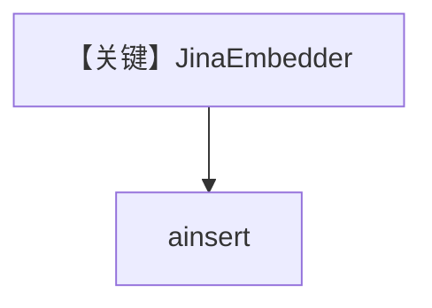

# jina_embedder.py — 实现原理分析

<!-- cookbook-py-source:start -->
## 完整源码

```python
"""
Jina Embedder
=============

Demonstrates Jina embeddings, usage metadata retrieval, and a batching variant.
"""

import asyncio

from agno.knowledge.embedder.jina import JinaEmbedder
from agno.knowledge.knowledge import Knowledge
from agno.vectordb.pgvector import PgVector


# ---------------------------------------------------------------------------
# Create Knowledge Base
# ---------------------------------------------------------------------------
def create_knowledge() -> Knowledge:
    # Standard mode
    embedder = JinaEmbedder(
        late_chunking=True,
        timeout=30.0,
    )

    # Batching mode (uncomment to use)
    # embedder = JinaEmbedder(
    #     late_chunking=True,
    #     timeout=30.0,
    #     enable_batch=True,
    # )

    return Knowledge(
        vector_db=PgVector(
            db_url="postgresql+psycopg://ai:ai@localhost:5532/ai",
            table_name="jina_embeddings",
            embedder=embedder,
        ),
        max_results=2,
    )


# ---------------------------------------------------------------------------
# Run Agent
# ---------------------------------------------------------------------------
async def main() -> None:
    embeddings = JinaEmbedder().get_embedding(
        "The quick brown fox jumps over the lazy dog."
    )
    print(f"Embeddings: {embeddings[:5]}")
    print(f"Dimensions: {len(embeddings)}")

    custom_embedder = JinaEmbedder(
        dimensions=1024,
        late_chunking=True,
        timeout=30.0,
    )
    embedding, usage = custom_embedder.get_embedding_and_usage(
        "Advanced text processing with Jina embeddings and late chunking."
    )
    print(f"Embedding dimensions: {len(embedding)}")
    if usage:
        print(f"Usage info: {usage}")

    knowledge = create_knowledge()
    await knowledge.ainsert(path="cookbook/07_knowledge/testing_resources/cv_1.pdf")


if __name__ == "__main__":
    asyncio.run(main())
```

<!-- cookbook-py-source:end -->

> 源文件：`cookbook/07_knowledge/09_archive/embedders/jina_embedder.py`

## 概述

**`JinaEmbedder(late_chunking=True, timeout=30.0)`** + `PgVector` 表 `jina_embeddings`；可选 batch 注释。**无 Agent**。

## System Prompt 组装

无 Agent。

## 完整 API 请求

Jina AI Embeddings API。

## Mermaid 流程图



## 关键源码文件索引

| 文件 | 作用 |
|------|------|
| `agno/knowledge/embedder/jina.py` | Jina |
