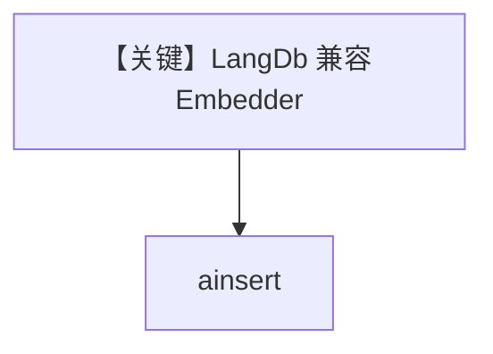

# langdb_embedder.py — 实现原理分析

> 源文件：`cookbook/07_knowledge/09_archive/embedders/langdb_embedder.py`

## 概述

**`LangDBEmbedder()`** + `PgVector` 表 `langdb_embeddings`；`get_embedding("Embed me")` 后 `ainsert` CV。**无 Agent**。

## System Prompt 组装

无 Agent。

## 完整 API 请求

LangDB/兼容 OpenAI 的嵌入端点。

## Mermaid 流程图

## 关键源码文件索引

| 文件 | 作用 |
|------|------|
| `agno/knowledge/embedder/langdb.py` | LangDB（若存在） |
