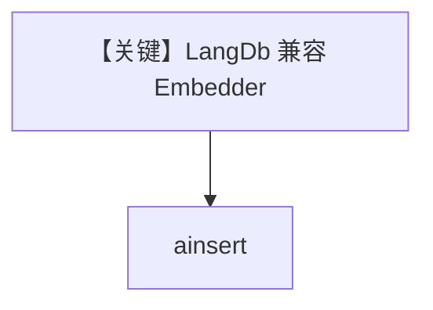

# langdb_embedder.py — 实现原理分析

<!-- cookbook-py-source:start -->
## 完整源码

```python
"""
LangDB Embedder
===============

Demonstrates LangDB embeddings and knowledge insertion.
"""

import asyncio

from agno.knowledge.embedder.langdb import LangDBEmbedder
from agno.knowledge.knowledge import Knowledge
from agno.vectordb.pgvector import PgVector

# ---------------------------------------------------------------------------
# Create Knowledge Base
# ---------------------------------------------------------------------------
knowledge = Knowledge(
    vector_db=PgVector(
        db_url="postgresql+psycopg://ai:ai@localhost:5532/ai",
        table_name="langdb_embeddings",
        embedder=LangDBEmbedder(),
    ),
    max_results=2,
)


# ---------------------------------------------------------------------------
# Run Agent
# ---------------------------------------------------------------------------
async def main() -> None:
    embeddings = LangDBEmbedder().get_embedding("Embed me")
    print(f"Embeddings: {embeddings[:5]}")
    print(f"Dimensions: {len(embeddings)}")

    await knowledge.ainsert(path="cookbook/07_knowledge/testing_resources/cv_1.pdf")


if __name__ == "__main__":
    asyncio.run(main())
```

<!-- cookbook-py-source:end -->

> 源文件：`cookbook/07_knowledge/09_archive/embedders/langdb_embedder.py`

## 概述

**`LangDBEmbedder()`** + `PgVector` 表 `langdb_embeddings`；`get_embedding("Embed me")` 后 `ainsert` CV。**无 Agent**。

## System Prompt 组装

无 Agent。

## 完整 API 请求

LangDB/兼容 OpenAI 的嵌入端点。

## Mermaid 流程图



## 关键源码文件索引

| 文件 | 作用 |
|------|------|
| `agno/knowledge/embedder/langdb.py` | LangDB（若存在） |
