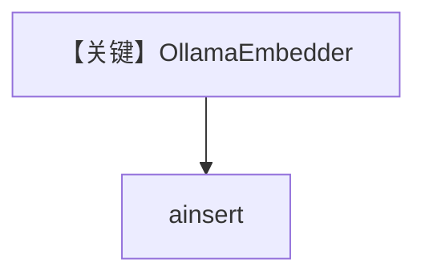

# ollama_embedder.py — 实现原理分析

> 源文件：`cookbook/07_knowledge/09_archive/embedders/ollama_embedder.py`

## 概述

**`OllamaEmbedder()`** 本地/局域网 Ollama 服务嵌入 + `PgVector` 表 `ollama_embeddings`，`ainsert` CV。**无 Agent**。

## System Prompt 组装

无 Agent。

## 完整 API 请求

Ollama HTTP `/api/embed`（由 embedder 封装）。

## Mermaid 流程图

## 关键源码文件索引

| 文件 | 作用 |
|------|------|
| `agno/knowledge/embedder/ollama.py` | Ollama |
