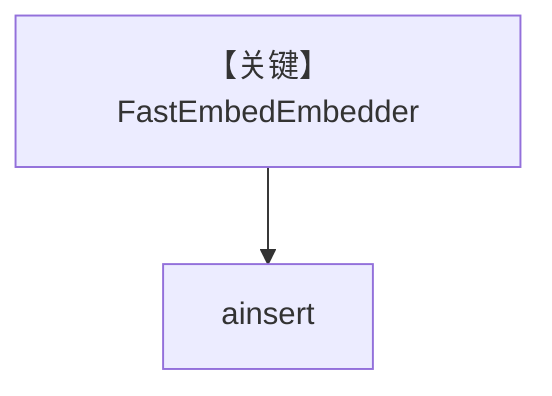

# qdrant_fastembed.py — 实现原理分析

> 源文件：`cookbook/07_knowledge/09_archive/embedders/qdrant_fastembed.py`

## 概述

**`FastEmbedEmbedder()`**（Qdrant FastEmbed）+ `PgVector` 表 `qdrant_embeddings`，本地轻量嵌入；`ainsert` CV。**无 Agent**。

## System Prompt 组装

无 Agent。

## 完整 API 请求

FastEmbed 本地推理，无云端 LLM。

## Mermaid 流程图

## 关键源码文件索引

| 文件 | 作用 |
|------|------|
| `agno/knowledge/embedder/fastembed.py` | FastEmbed |
