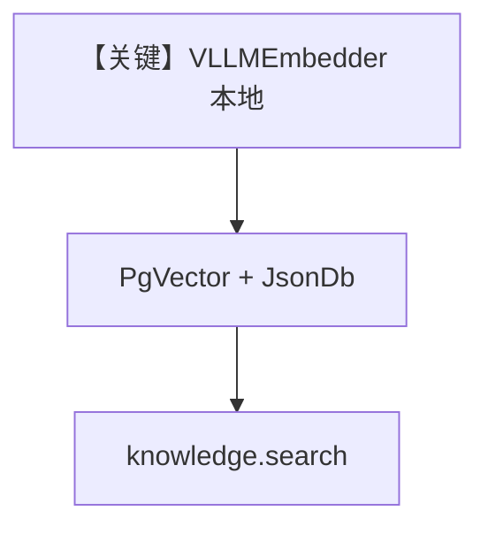

# vllm_embedder_local.py — 实现原理分析

> 源文件：`cookbook/07_knowledge/09_archive/embedders/vllm_embedder_local.py`

## 概述

**本地 `VLLMEmbedder`**：`sentence-transformers/all-MiniLM-L6-v2`，`dimensions=384`，`enforce_eager=True`，`vllm_kwargs` 限制上下文；`PgVector` + **`JsonDb` contents**；`run_variant` 对比 `enable_batch` 两种表名；最后 **`knowledge.search` 打印结果**。**无 Agent**。

**核心配置一览：**

| 配置项 | 值 | 说明 |
|--------|------|------|
| `VLLMEmbedder` | 本地 vLLM 推理 | GPU/CPU 依赖 |
| `contents_db` | `JsonDb` | 内容追踪 |
| `run_search` | 直接 `knowledge.search` | 验证检索 |

## System Prompt 组装

无 Agent。

## 完整 API 请求

vLLM 本地嵌入引擎；无 OpenAI Chat。

## Mermaid 流程图

## 关键源码文件索引

| 文件 | 作用 |
|------|------|
| `agno/knowledge/embedder/vllm.py` | VLLM |
