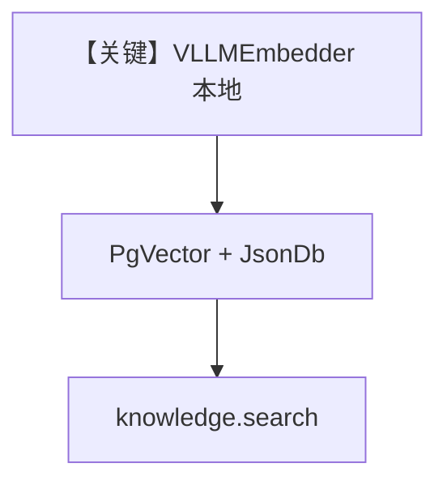

# vllm_embedder_local.py — 实现原理分析

<!-- cookbook-py-source:start -->
## 完整源码

```python
"""
vLLM Local Embedder
===================

Demonstrates local vLLM embeddings and knowledge insertion with standard and batching modes.
"""

import asyncio

from agno.db.json import JsonDb
from agno.knowledge.embedder.vllm import VLLMEmbedder
from agno.knowledge.knowledge import Knowledge
from agno.vectordb.pgvector import PgVector


# ---------------------------------------------------------------------------
# Create Knowledge Base
# ---------------------------------------------------------------------------
def create_embedder(enable_batch: bool = False) -> VLLMEmbedder:
    return VLLMEmbedder(
        id="sentence-transformers/all-MiniLM-L6-v2",
        dimensions=384,
        enforce_eager=True,
        enable_batch=enable_batch,
        batch_size=10,
        vllm_kwargs={
            "disable_sliding_window": True,
            "max_model_len": 256,
        },
    )


def create_knowledge(
    embedder: VLLMEmbedder, table_name: str, knowledge_table: str
) -> Knowledge:
    return Knowledge(
        vector_db=PgVector(
            db_url="postgresql+psycopg://ai:ai@localhost:5532/ai",
            table_name=table_name,
            embedder=embedder,
        ),
        contents_db=JsonDb(
            db_path="./knowledge_contents",
            knowledge_table=knowledge_table,
        ),
        max_results=2,
    )


# ---------------------------------------------------------------------------
# Run Agent
# ---------------------------------------------------------------------------
def run_search(knowledge: Knowledge) -> None:
    query = "What are the candidate's skills?"
    results = knowledge.search(query=query)
    print(f"Query: {query}")
    print(f"Results found: {len(results)}")
    for i, result in enumerate(results, 1):
        print(f"Result {i}: {result.content[:100]}...")


async def run_variant(enable_batch: bool = False) -> None:
    embedder = create_embedder(enable_batch=enable_batch)
    mode = "batched" if enable_batch else "standard"

    embeddings = embedder.get_embedding("The quick brown fox jumps over the lazy dog.")
    print(f"Mode: {mode}")
    print(f"Embedding dimensions: {len(embeddings)}")
    print(f"First 5 values: {embeddings[:5]}")

    table_name = (
        "vllm_embeddings_minilm_batch_local"
        if enable_batch
        else "vllm_embeddings_minilm_local"
    )
    knowledge_table = (
        "vllm_batch_local_knowledge" if enable_batch else "vllm_local_knowledge"
    )
    knowledge = create_knowledge(embedder, table_name, knowledge_table)

    await knowledge.ainsert(path="cookbook/07_knowledge/testing_resources/cv_1.pdf")
    run_search(knowledge)


if __name__ == "__main__":
    asyncio.run(run_variant(enable_batch=False))
    asyncio.run(run_variant(enable_batch=True))
```

<!-- cookbook-py-source:end -->

> 源文件：`cookbook/07_knowledge/09_archive/embedders/vllm_embedder_local.py`

## 概述

**本地 `VLLMEmbedder`**：`sentence-transformers/all-MiniLM-L6-v2`，`dimensions=384`，`enforce_eager=True`，`vllm_kwargs` 限制上下文；`PgVector` + **`JsonDb` contents**；`run_variant` 对比 `enable_batch` 两种表名；最后 **`knowledge.search` 打印结果**。**无 Agent**。

**核心配置一览：**

| 配置项 | 值 | 说明 |
|--------|------|------|
| `VLLMEmbedder` | 本地 vLLM 推理 | GPU/CPU 依赖 |
| `contents_db` | `JsonDb` | 内容追踪 |
| `run_search` | 直接 `knowledge.search` | 验证检索 |

## System Prompt 组装

无 Agent。

## 完整 API 请求

vLLM 本地嵌入引擎；无 OpenAI Chat。

## Mermaid 流程图



## 关键源码文件索引

| 文件 | 作用 |
|------|------|
| `agno/knowledge/embedder/vllm.py` | VLLM |
