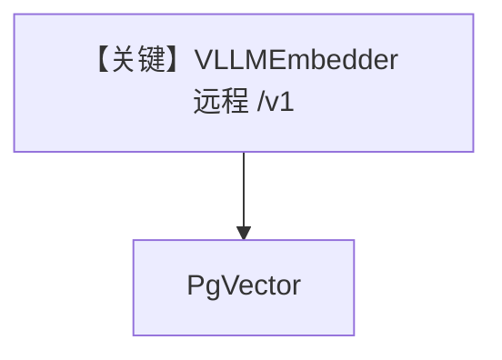

# vllm_embedder_remote.py — 实现原理分析

> 源文件：`cookbook/07_knowledge/09_archive/embedders/vllm_embedder_remote.py`

## 概述

**远程 `VLLMEmbedder`**：`base_url="http://localhost:8000/v1"`，OpenAI 兼容嵌入端；`PgVector` + `JsonDb`；标准/batch 变体。**无 Agent**，流程与 `vllm_embedder_local.py` 对称。

## System Prompt 组装

无 Agent。

## 完整 API 请求

HTTP 调用远程 vLLM/OpenAPI 兼容嵌入服务。

## Mermaid 流程图

## 关键源码文件索引

| 文件 | 作用 |
|------|------|
| `agno/knowledge/embedder/vllm.py` | 远程 base_url |
