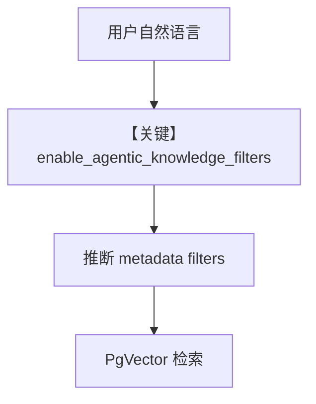

# agentic_filtering.py — 实现原理分析

> 源文件：`cookbook/07_knowledge/09_archive/filters/agentic_filtering.py`

## 概述

**Agentic 元数据过滤**：`PostgresDb` contents + `PgVector`，`insert_many` 销售 CSV 带 metadata；`Agent(OpenAIChat("gpt-5.2"), enable_agentic_knowledge_filters=True)`，由模型从自然语言问题中 **推断过滤条件** 再检索。

**核心配置一览：**

| 配置项 | 值 | 说明 |
|--------|------|------|
| `enable_agentic_knowledge_filters` | `True` | 自动推断 filters |
| `contents_db` | `PostgresDb` | 可选校验元数据键 |
| `model` | `OpenAIChat("gpt-5.2")` | Chat |

## System Prompt 组装

含 Chat 默认与知识检索说明；`enable_agentic_knowledge_filters` 会附加相关指令（运行时打印确认）。

## 完整 API 请求

`chat.completions.create`。

## Mermaid 流程图

## 关键源码文件索引

| 文件 | 作用 |
|------|------|
| `agno/agent/agent.py` | `enable_agentic_knowledge_filters` |
| `agno/vectordb/pgvector` | 过滤查询 |
