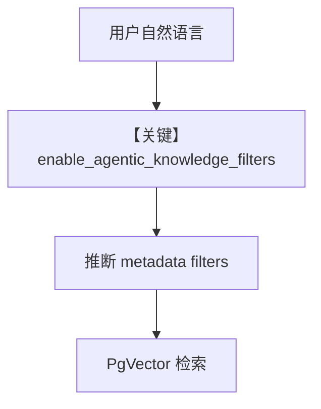

# agentic_filtering.py — 实现原理分析

<!-- cookbook-py-source:start -->
## 完整源码

```python
from agno.agent import Agent
from agno.db.postgres import PostgresDb
from agno.knowledge.knowledge import Knowledge
from agno.models.openai import OpenAIChat
from agno.utils.media import (
    SampleDataFileExtension,
    download_knowledge_filters_sample_data,
)
from agno.vectordb.pgvector import PgVector

# Download all sample sales files and get their paths
downloaded_csv_paths = download_knowledge_filters_sample_data(
    num_files=4, file_extension=SampleDataFileExtension.CSV
)

# Initialize PgVector
vector_db = PgVector(
    table_name="recipes",
    db_url="postgresql+psycopg://ai:ai@localhost:5532/ai",
)

# Step 1: Initialize knowledge base with documents and metadata
# ------------------------------------------------------------------------------
# Note: ContentsDB is OPTIONAL for agentic filtering
# - Without ContentsDB: Filters work but are not validated against known metadata keys
# - With ContentsDB: Filter keys are validated, improving reliability and providing helpful warnings
#
# Example without ContentsDB (filtering still works):
# knowledge = Knowledge(
#     name="CSV Knowledge Base",
#     description="A knowledge base for CSV files",
#     vector_db=vector_db,
#     # contents_db not provided - agentic filtering will work without validation
# )
#
# Example WITH ContentsDB (adds filter validation):
knowledge = Knowledge(
    name="CSV Knowledge Base",
    description="A knowledge base for CSV files",
    vector_db=vector_db,
    contents_db=PostgresDb(  # Optional - enables filter validation
        db_url="postgresql+psycopg://ai:ai@localhost:5532/ai",
        knowledge_table="knowledge_contents",
    ),
)

# Load all documents into the vector database
knowledge.insert_many(
    [
        {
            "path": downloaded_csv_paths[0],
            "metadata": {
                "data_type": "sales",
                "quarter": "Q1",
                "year": 2024,
                "region": "north_america",
                "currency": "USD",
            },
        },
        {
            "path": downloaded_csv_paths[1],
            "metadata": {
                "data_type": "sales",
                "year": 2024,
                "region": "europe",
                "currency": "EUR",
            },
        },
        {
            "path": downloaded_csv_paths[2],
            "metadata": {
                "data_type": "survey",
                "survey_type": "customer_satisfaction",
                "year": 2024,
                "target_demographic": "mixed",
            },
        },
        {
            "path": downloaded_csv_paths[3],
            "metadata": {
                "data_type": "financial",
                "sector": "technology",
                "year": 2024,
                "report_type": "quarterly_earnings",
            },
        },
    ],
    skip_if_exists=True,
)
# Step 2: Query the knowledge base with Agent using filters from query automatically
# -----------------------------------------------------------------------------------

# Enable agentic filtering
agent = Agent(
    model=OpenAIChat("gpt-5.2"),
    knowledge=knowledge,
    search_knowledge=True,
    enable_agentic_knowledge_filters=True,
)

agent.print_response(
    "Tell me about revenue performance and top selling products in the region north_america",
    markdown=True,
)
```

<!-- cookbook-py-source:end -->

> 源文件：`cookbook/07_knowledge/09_archive/filters/agentic_filtering.py`

## 概述

**Agentic 元数据过滤**：`PostgresDb` contents + `PgVector`，`insert_many` 销售 CSV 带 metadata；`Agent(OpenAIChat("gpt-5.2"), enable_agentic_knowledge_filters=True)`，由模型从自然语言问题中 **推断过滤条件** 再检索。

**核心配置一览：**

| 配置项 | 值 | 说明 |
|--------|------|------|
| `enable_agentic_knowledge_filters` | `True` | 自动推断 filters |
| `contents_db` | `PostgresDb` | 可选校验元数据键 |
| `model` | `OpenAIChat("gpt-5.2")` | Chat |

## System Prompt 组装

含 Chat 默认与知识检索说明；`enable_agentic_knowledge_filters` 会附加相关指令（运行时打印确认）。

## 完整 API 请求

`chat.completions.create`。

## Mermaid 流程图



## 关键源码文件索引

| 文件 | 作用 |
|------|------|
| `agno/agent/agent.py` | `enable_agentic_knowledge_filters` |
| `agno/vectordb/pgvector` | 过滤查询 |
