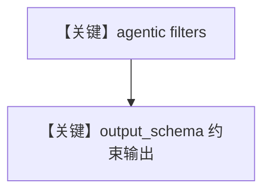

# agentic_filtering_with_output_schema.py — 实现原理分析

> 源文件：`cookbook/07_knowledge/09_archive/filters/agentic_filtering_with_output_schema.py`

## 概述

在 **`agentic_filtering.py` 同结构** 上增加 **`output_schema=CSVDataOutput`**（Pydantic），使结构化输出与 **agentic filters** 同屏演示：`get_system_message` 中 `# 3.2.1` 在存在 `output_schema` 时 **不** 因 `markdown` 追加默认行（见 `_messages.py` L184 条件）。

**核心配置一览：**

| 配置项 | 值 | 说明 |
|--------|------|------|
| `output_schema` | `CSVDataOutput` | 结构化输出 |
| `enable_agentic_knowledge_filters` | `True` | 自动过滤 |

## System Prompt 组装

与纯 agentic 过滤类似，但受 `output_schema` 影响，默认 markdown 附加段可能不注入；以 `_messages.py` L184 为准。

## 完整 API 请求

`OpenAIChat` + 结构化输出模式（依模型能力）。

## Mermaid 流程图

## 关键源码文件索引

| 文件 | 作用 |
|------|------|
| `agno/agent/_messages.py` | L184 `markdown and output_schema is None` |
