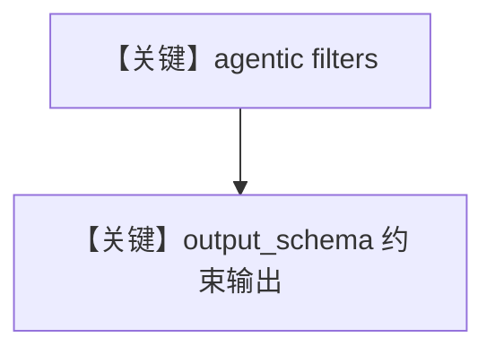

# agentic_filtering_with_output_schema.py — 实现原理分析

<!-- cookbook-py-source:start -->
## 完整源码

```python
from agno.agent import Agent
from agno.db.postgres import PostgresDb
from agno.knowledge.knowledge import Knowledge
from agno.models.openai import OpenAIChat
from agno.utils.media import (
    SampleDataFileExtension,
    download_knowledge_filters_sample_data,
)
from agno.vectordb.pgvector import PgVector
from pydantic import BaseModel

# Download all sample sales files and get their paths
downloaded_csv_paths = download_knowledge_filters_sample_data(
    num_files=4, file_extension=SampleDataFileExtension.CSV
)

# Initialize PgVector
vector_db = PgVector(
    table_name="recipes",
    db_url="postgresql+psycopg://ai:ai@localhost:5532/ai",
)


class CSVDataOutput(BaseModel):
    data_type: str
    quarter: str
    year: int
    region: str
    currency: str


# Step 1: Initialize knowledge base with documents and metadata
# ------------------------------------------------------------------------------

knowledge = Knowledge(
    name="CSV Knowledge Base",
    description="A knowledge base for CSV files",
    vector_db=vector_db,
    contents_db=PostgresDb(
        db_url="postgresql+psycopg://ai:ai@localhost:5532/ai",
        knowledge_table="knowledge_contents",
    ),
)

# Load all documents into the vector database
knowledge.insert_many(
    [
        {
            "path": downloaded_csv_paths[0],
            "metadata": {
                "data_type": "sales",
                "quarter": "Q1",
                "year": 2024,
                "region": "north_america",
                "currency": "USD",
            },
        },
        {
            "path": downloaded_csv_paths[1],
            "metadata": {
                "data_type": "sales",
                "year": 2024,
                "region": "europe",
                "currency": "EUR",
            },
        },
        {
            "path": downloaded_csv_paths[2],
            "metadata": {
                "data_type": "survey",
                "survey_type": "customer_satisfaction",
                "year": 2024,
                "target_demographic": "mixed",
            },
        },
        {
            "path": downloaded_csv_paths[3],
            "metadata": {
                "data_type": "financial",
                "sector": "technology",
                "year": 2024,
                "report_type": "quarterly_earnings",
            },
        },
    ],
    skip_if_exists=True,
)
# Step 2: Query the knowledge base with Agent using filters from query automatically
# -----------------------------------------------------------------------------------

# Enable agentic filtering
agent = Agent(
    model=OpenAIChat("gpt-5.2"),
    knowledge=knowledge,
    search_knowledge=True,
    enable_agentic_knowledge_filters=True,
    output_schema=CSVDataOutput,
)

agent.print_response(
    "Tell me about revenue performance and top selling products in the region north_america and data_type sales",
    markdown=True,
)
```

<!-- cookbook-py-source:end -->

> 源文件：`cookbook/07_knowledge/09_archive/filters/agentic_filtering_with_output_schema.py`

## 概述

在 **`agentic_filtering.py` 同结构** 上增加 **`output_schema=CSVDataOutput`**（Pydantic），使结构化输出与 **agentic filters** 同屏演示：`get_system_message` 中 `# 3.2.1` 在存在 `output_schema` 时 **不** 因 `markdown` 追加默认行（见 `_messages.py` L184 条件）。

**核心配置一览：**

| 配置项 | 值 | 说明 |
|--------|------|------|
| `output_schema` | `CSVDataOutput` | 结构化输出 |
| `enable_agentic_knowledge_filters` | `True` | 自动过滤 |

## System Prompt 组装

与纯 agentic 过滤类似，但受 `output_schema` 影响，默认 markdown 附加段可能不注入；以 `_messages.py` L184 为准。

## 完整 API 请求

`OpenAIChat` + 结构化输出模式（依模型能力）。

## Mermaid 流程图



## 关键源码文件索引

| 文件 | 作用 |
|------|------|
| `agno/agent/_messages.py` | L184 `markdown and output_schema is None` |
