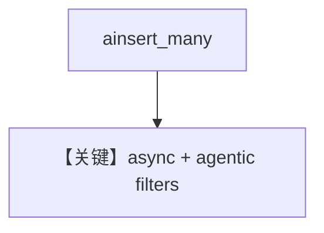

# async_agentic_filtering.py — 实现原理分析

> 源文件：`cookbook/07_knowledge/09_archive/filters/async_agentic_filtering.py`

## 概述

**异步路径 + agentic filters**：`ainsert_many`、异步 DB 客户端与 `Agent` 的异步 `print_response`（或等价）组合；向量库为 **PgVector**。细节以源文件为准，与同步 `agentic_filtering` 对照学习。

## System Prompt 组装

与 agentic 过滤同类。

## 完整 API 请求

异步 `achat` / `ainvoke` 链。

## Mermaid 流程图

## 关键源码文件索引

| 文件 | 作用 |
|------|------|
| `agno/knowledge/knowledge.py` | `ainsert_many` |
