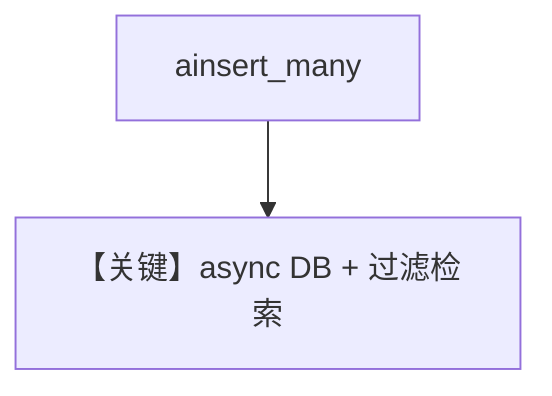

# async_filtering.py — 实现原理分析

> 源文件：`cookbook/07_knowledge/09_archive/filters/async_filtering.py`

## 概述

**异步 contents + 元数据过滤**：`AsyncPostgresDb`（或示例中切换）+ `PgVector`，`knowledge.ainsert_many` 写入带 `user_id` 等 metadata；随后 **`aprint_response`** 与 `knowledge_filters`（如 `IN`）演示异步检索。

**核心配置一览：**

| 配置项 | 值 | 说明 |
|--------|------|------|
| `contents_db` | `AsyncPostgresDb` | 异步内容库 |
| `knowledge_filters` | 表达式列表如 `IN(...)` | 见文件后半 |

## System Prompt 组装

默认 Agent；无单独 `instructions` 则走默认拼装。

## 完整 API 请求

异步 Chat Completions。

## Mermaid 流程图

## 关键源码文件索引

| 文件 | 作用 |
|------|------|
| `agno/db/postgres` | `AsyncPostgresDb` |
