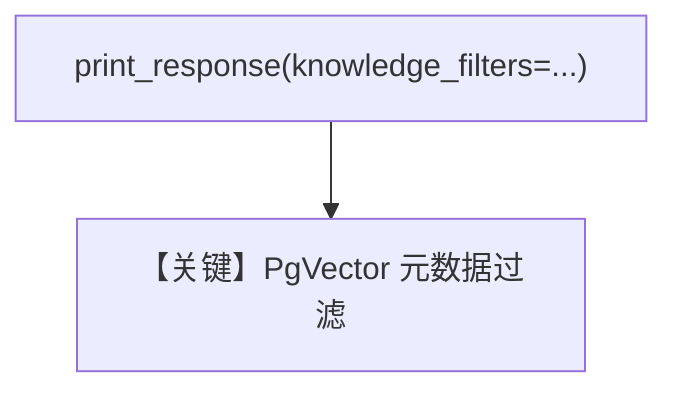

# filtering.py — 实现原理分析

<!-- cookbook-py-source:start -->
## 完整源码

```python
from agno.agent import Agent
from agno.db.postgres.postgres import PostgresDb
from agno.knowledge.knowledge import Knowledge
from agno.utils.media import (
    SampleDataFileExtension,
    download_knowledge_filters_sample_data,
)
from agno.vectordb.pgvector import PgVector

# Download all sample sales documents and get their paths
downloaded_csv_paths = download_knowledge_filters_sample_data(
    num_files=4, file_extension=SampleDataFileExtension.CSV
)

# Initialize PgVector
vector_db = PgVector(
    table_name="recipes",
    db_url="postgresql+psycopg://ai:ai@localhost:5532/ai",
)

contents_db = PostgresDb(
    db_url="postgresql+psycopg://ai:ai@localhost:5532/ai",
    knowledge_table="knowledge_contents",
)

# Step 1: Initialize knowledge with documents and metadata
# -----------------------------------------------------------------------------
knowledge = Knowledge(
    name="CSV Knowledge Base",
    description="A knowledge base for CSV files",
    vector_db=vector_db,
    contents_db=contents_db,
)

# Load all documents into the vector database
knowledge.insert_many(
    [
        {
            "path": downloaded_csv_paths[0],
            "metadata": {
                "data_type": "sales",
                "quarter": "Q1",
                "year": 2024,
                "region": "north_america",
                "currency": "USD",
            },
        },
        {
            "path": downloaded_csv_paths[1],
            "metadata": {
                "data_type": "sales",
                "year": 2024,
                "region": "europe",
                "currency": "EUR",
            },
        },
        {
            "path": downloaded_csv_paths[2],
            "metadata": {
                "data_type": "survey",
                "survey_type": "customer_satisfaction",
                "year": 2024,
                "target_demographic": "mixed",
            },
        },
        {
            "path": downloaded_csv_paths[3],
            "metadata": {
                "data_type": "financial",
                "sector": "technology",
                "year": 2024,
                "report_type": "quarterly_earnings",
            },
        },
    ],
)

# Step 2: Query the knowledge base with different filter combinations
# ------------------------------------------------------------------------------
na_sales = Agent(
    knowledge=knowledge,
    search_knowledge=True,
)

na_sales.print_response(
    "Revenue performance and top selling products",
    knowledge_filters={"region": "north_america", "data_type": "sales"},
    markdown=True,
)
```

<!-- cookbook-py-source:end -->

> 源文件：`cookbook/07_knowledge/09_archive/filters/filtering.py`

## 概述

**显式 `knowledge_filters` 字典**：`PgVector` + `PostgresDb` contents，`insert_many` CSV；`Agent(knowledge=..., search_knowledge=True)` **`无显式 model`**，第一次 `print_response` 传入 `knowledge_filters={"region": "north_america", "data_type": "sales"}`。

**核心配置一览：**

| 配置项 | 值 | 说明 |
|--------|------|------|
| `knowledge_filters` | `dict` | 精确键值过滤 |

## System Prompt 组装

默认；无 `instructions`。

## 完整 API 请求

默认 Model 的 `chat.completions`。

## Mermaid 流程图



## 关键源码文件索引

| 文件 | 作用 |
|------|------|
| `agno/knowledge/knowledge.py` | `search` 传 filters |
